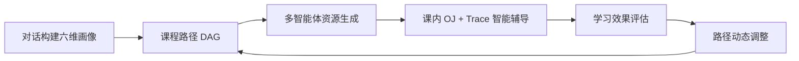
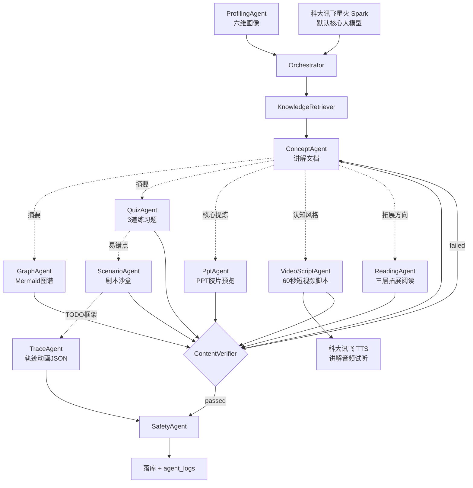
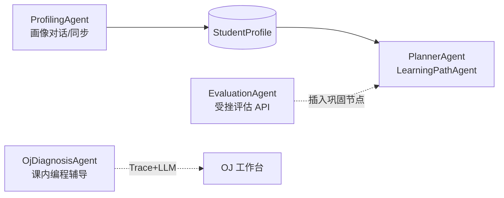

<div align="center">

# AlgoPilot

### 面向高校《数据结构与算法》课程的个性化多模态学习资源生成与多智能体协同学习系统

**第十五届中国软件杯 · A3 赛道参赛系统**

> 产品品牌 **AlgoPilot**（算法领航者）。Web 界面与 API 标题仍显示历史名称「算法智能学习平台」，与本文档定位一致，指同一套系统。

<br/>

[](https://vuejs.org/)
[](https://fastapi.tiangolo.com/)
[](https://www.python.org/)
[](https://www.typescriptlang.org/)

<br/>

AlgoPilot 面向高校 **《数据结构与算法》** 课程：学生通过自然语言构建 **六维学习画像**；系统基于课程知识库、画像与学习行为，由 **多智能体** 生成讲解文档、思维导图、分层练习、实操案例、PPT、短视频脚本、Trace 动画等个性化资源，并规划 **DAG 学习路径**、提供 **智能辅导** 与 **学习效果评估**，实现因材施教。课内 **在线评测（OJ）** 与 **Trace Engine** 用于课程编程实践与代码诊断，是智能辅导链路的一环，而非独立刷题平台。

<br/>

[赛题适配](#-赛题适配说明) ·
[课程场景](#-课程场景说明) ·
[演示闭环](#-比赛演示闭环) ·
[快速开始](#-快速开始-quick-start) ·
[智能体拓扑](#-多智能体集群角色分工与协同) ·
[课程实操与 Trace](#-课程实操案例与智能辅导trace-engine) ·
[技术栈](#-技术栈与开源框架致谢-technology-stack--credits)

</div>

---

## 📌 赛题适配说明

本系统严格围绕 **中国软件杯 A3 赛题**「基于大模型的个性化资源生成与学习多智能体系统开发」，五大核心能力与实现落点如下。

| A3 核心功能 | 本系统实现 | 代码 / 页面落点 |
|-------------|------------|-----------------|
| **1. 对话式学习画像自主构建** | 破冰多轮对话 + `ProfilingAgent` 抽取 **6 维**画像（文本 + 1–10 分 + 明确/推断置信度）；支持 `patch-from-learning` **随学随新** | `PersonaChatPanel` · `/api/orchestrator/persona/*` |
| **2. 多智能体协同资源生成** | **8 类**个性化资源（满足「≥5 类」）；RAG → 生成 ⇄ `ContentVerifierAgent` → `SafetyAgent`；SSE 流式 + `agent_logs` | `AgentWorkbenchView` · `workflow.py` |
| **3. 个性化学习路径规划与资源推送** | `LearningPathAgent` 按先修 DAG、画像分数与模块掌握度排序；`GET /resources/recommendations` 精准推送 | `LearningPathView` · `AlgorithmUniverseGraph` |
| **4. 智能辅导（重点加分项）** | `TutorAgent` 模块答疑；`OjAssistantAgent` 思路提示；`OjDiagnosisAgent` 结合 **OJ 提交 + Trace + LLM** 定位错误步 | 模块内 `AiTutorPanel` · OJ 工作台 |
| **5. 学习效果评估（重点加分项）** | `EvaluationAgent` 输出可解释多维得分、叙事建议、`push_strategy`；支持一键触发路径重排 | `MyLearningView` · `POST /evaluation` |

**赛题共性能力（已实现）**：防幻觉（知识库校验 + 溯源 ID）、内容安全过滤、流式输出、生成进度追踪、Markdown 渲染、多模态资源卡片化展示。  
**科大讯飞**：星火 Spark（默认大模型）+ 在线 TTS；开发过程使用 iFlyCode 辅助（见文末声明）。

---

## 📚 课程场景说明

**课程名称**：《数据结构与算法》（课纲见 `backend/knowledge_base/syllabus.json`，课程代码 `CS-DSA-101`）。

**教学目标**：以抽象数据类型、算法范式、复杂度分析与 **课内编程实践** 为主线，支撑后续专业课程。

**章节与平台模块对应**（与课内目录一致；`available: false` 的模块在学习路径中显示「规划中」，当前 12 个主线模块均已开放）：

| 课程知识域 | 平台模块 / 说明 |
|------------|-----------------|
| 线性表（顺序表、链表） | `array`、`linked-list` |
| 栈、队列 | `stack-queue` |
| 字符串与双指针技巧 | `string`、`two-pointers` |
| 查找（哈希、二分等） | `hash-table`；二分等融入 `array` 题单与知识切片 |
| 树（二叉树、遍历、BST） | `binary-tree` |
| 图（搜索、最短路入门） | `graph`（`/learn/graph`，ch06-graph / graph-bfs-dfs） |
| 排序 | 融入 `array` 等模块讲义与 OJ 题单（无独立「排序」模块名） |
| 递归 | 贯穿 `binary-tree`、`backtracking` 等 |
| 分治 | 讲义与题单中作为范式讲解（与贪心/递归题交叉） |
| 贪心 | `greedy` |
| 动态规划 | `dp` |
| 回溯 | `backtracking` |
| 单调栈等拓展 | `monotonic-stack` |

**课程知识库**：`knowledge/courses/data_structures_algorithms/`（`course_manifest.yaml` + 14 章 Markdown + 实验/项目）与 `knowledge_base/chunks.json`（模块切片）合并检索；`services/knowledge/retriever.py`（BM25 + 同义词）。

---

## 🔄 比赛演示闭环

建议 **7 分钟** 答辩视频按下列顺序录制（配置 `SPARK_API_PASSWORD` 可展示完整 LLM 能力；未配置时画像与资源生成可走模板降级，OJ 诊断与路径规划仍可用）：



| 步骤 | 演示动作 | 页面 / API |
|------|----------|------------|
| 1 画像 | 登录 → 学习路径页破冰对话 → 同步画像 → 六维雷达 | `LearningPathView` · `PersonaChatPanel` |
| 2 路径 | 查看推荐模块顺序、先修边、下一步建议 | `AlgorithmUniverseGraph` · `POST /learning-path/replan` |
| 3 资源 | 多智能体工作台批量生成 → 终端日志 → 安全校验面板 → 资源库多 Tab 展示 | `AgentWorkbenchView` · `ResourceLibraryView` |
| 4 辅导 | 模块讲义 + AI 助教；OJ 提交 WA → Trace 动画 → AI 诊断 | 模块学习页 · `PracticeProblemView` |
| 5 评估 | 我的学习 → 效果评估 → 查看得分与推送策略 → 「按评估重排路径」 | `LearningEvaluationPanel` · `POST /evaluation` |
| 6 调整 | 展示路径顺序变化；连续非 AC ≥3 次时 OJ 页自动调用 `POST /evaluation/oj-struggle`（**已实现自动触发**） | 路径页 / OJ 练习页 |

---

## ✨ 核心能力一览

| 能力域 | 关键实现（代码落点） |
|--------|----------------------|
| **对话式画像** | 破冰引导 + `ProfilingAgent` 六维文本与 **1–10 分** → `PersonaRadarChart` |
| **DAG 学习路径** | `LearningPathAgent` 拓扑排序 + 画像分数 + `prerequisites` / 阶段难度 |
| **多模态资源** | `CORE_RESOURCE_PIPELINE` 八类资源；RAG → 生成 ⇄ 校验 → `SafetyAgent` |
| **学情自适应** | `EvaluationAgent`；连续 3 次 WA/RE/TLE/CE 可经 `oj-struggle` 建议插入巩固节点（见演示闭环说明） |
| **内容安全** | C++ 静态危险调用拦截 + `SafetyAgent` 审查；`SafetyValidationPanel` 可视化 |
| **课程实操与 Trace** | 课内 OJ + `trace_runner` / `gdb_stl_extract` → 动画与 `OjDiagnosisAgent` |

---

## 🤖 多智能体集群角色分工与协同

**编排原则**：画像、路径、资源、评估等 LLM 能力统一经 `Orchestrator` 调度（`backend/services/orchestrator/`），**禁止业务 API 直连大模型**。  
资源生成阶段的 `agent_logs` 与 SSE 事件回传前端 **Agent Synergy Terminal**（`AgentThinkingConsole.vue`）。

### 资源生成流水线（与代码一致）



> `trace_animation` 跳过文本校验（`workflow._SKIP_VERIFY_TYPES`），由 TraceAgent 内部对接 Trace Runner。

### 跨模块协同（独立 API，非上图单次调用）



### 核心智能体家族

| 图标 | 展示名 / 代码 ID | 核心职责 |
|:----:|------------------|----------|
| 🎯 | **ProfilerAgent** / `ProfilingAgent` | 自然语言破冰；`sync-from-stored` 抽取 **6 维**特征与量化分。 |
| 🗺️ | **PlannerAgent** / `LearningPathAgent` | 依据画像与模块进度 DAG 排序；可插播巩固模块。 |
| 🏭 | **Generator Swarm** | 八类资源：`document` · `mindmap` · `exercises` · `code_case` · `trace_animation` · `ppt` · `video_script` · `reading`。 |
| ↳ | `ConceptAgent` | Markdown 讲解文档（流式 SSE）。 |
| ↳ | `GraphAgent` | Mermaid 知识图谱。 |
| ↳ | `QuizAgent` | 个性化 **3 道**练习题。 |
| ↳ | `ScenarioAgent` | 剧情沙盒 + `// TODO` 代码框架（课程实操案例）。 |
| ↳ | `TraceAgent` | 轨迹动画 JSON（对接 Trace Runner）。 |
| ↳ | `PptAgent` / `VideoScriptAgent` / `ReadingAgent` | PPT 胶片、短视频脚本、分层拓展阅读。 |
| 🚑 | `EvaluationAgent` | 多维学习效果评估；`POST /evaluation/oj-struggle` 供受挫路径重规划（OJ 页 **已实现自动触发**）。 |
| 🛡️ | `SafetyAgent` | 敏感词 / 幻觉题号预警 / Prompt 注入粗检。 |
| 🔬 | `OjDiagnosisAgent` | 课内编程辅导：`/api/oj/.../ai/diagnose`，边界测例 + Trace + LLM。 |
| 🔍 | `KnowledgeRetriever` | **Okapi BM25** + 同义词扩展。 |
| ✅ | `ContentVerifierAgent` | 对照知识库校验，失败回流重试（最多 2 次）。 |

**C++ 提交安全**：`check_cpp_security()` 静态拦截危险系统调用（`utils/security.py`）。**Docker 进程隔离为可选部署项**（见 `backend/docs/OJ.md` 规划说明）。

---

## ⚙️ 课程实操案例与智能辅导（Trace Engine）

Trace Engine 支撑 **《数据结构与算法》课内编程实践**：学生提交课程 OJ 代码后，系统按行采集变量快照并驱动前端动画，配合 LLM 完成 **智能辅导与错因定位**——与多智能体教案生成互补，而非替代画像与路径规划。

### 技术原理

| 语言 | 机制 | 实现文件 |
|------|------|----------|
| **Python** | `sys.settrace` 行级钩子 | `services/oj/trace_runner.py`（子进程隔离执行） |
| **C++** | GDB + `gdb_stl_extract.py` | `services/oj/cpp_trace_runner.py`；失败时正则回退 |

### 协议与前端（`trace_viz`）

| 类型 | 说明 | 前端组件 |
|------|------|----------|
| `sequence` + `view_hint` | 栈/队列/向量等 | `frontend/src/components/oj/trace/` |
| `matrix` / `linked_list` / `tree` | 专用可视化 | `TraceMatrixGrid` 等 |

### AI 诊断（智能辅导管线）

```
课内 OJ 提交未通过 → ai/diagnose（OjDiagnosisAgent）
  → 边界微测例 + 判题 + Trace 录制
  → changed 精简序列 → LLM 根因与 bug_step_index
```

协议：`backend/docs/trace_viz_schema.md`。

### 演示旁白（有限 Mock）

`trace_demo_narration.py` 为**部分题目**提供**无 LLM** 规则旁白兜底；**不能**替代画像对话、资源生成或 AI 诊断（后者依赖 API Key）。

---

## 🛠️ 技术栈与开源框架致谢 (Technology Stack & Credits)

以下为仓库**实际依赖**（见 `frontend/package.json`、`backend/requirements.txt`）。

### 前端

| 技术 | 用途 |
|------|------|
| [Vue 3](https://vuejs.org/) + [Vite 8](https://vitejs.dev/) | UI 与构建 |
| [TypeScript](https://www.typescriptlang.org/) ~6.x | 类型系统 |
| [Vue Router 4](https://router.vuejs.org/) | 路由 |
| [Element Plus](https://element-plus.org/) | 组件库 |
| [CodeMirror 6](https://codemirror.net/) | 课内 OJ 编辑器 |
| [Mermaid](https://mermaid.js.org/) | 思维导图展示 |
| [Axios](https://axios-http.com/) | HTTP |
| [Pinia](https://pinia.vuejs.org/) | 全局状态 |
| [@vue-flow/core](https://vueflow.dev/) | 概念知识图谱 |

### 后端

| 技术 | 用途 |
|------|------|
| [FastAPI](https://fastapi.tiangolo.com/) + [Uvicorn](https://www.uvicorn.org/) | API / ASGI |
| [Pydantic v2](https://docs.pydantic.dev/) | Schema |
| [SQLAlchemy 2](https://www.sqlalchemy.org/) | ORM（默认 SQLite） |
| [httpx](https://www.python-httpx.org/) | 异步调用大模型 |
| [pytest](https://docs.pytest.org/) + [ruff](https://docs.astral.sh/ruff/) | 测试与 lint |

### 运行时与模型

| 组件 | 用途 |
|------|------|
| CPython `sys.settrace` | Python Trace |
| MinGW `g++` / `gdb` | C++ 编译与 STL Trace（**可选**，未安装时 C++ 能力受限） |
| [讯飞星火 Spark](https://www.xfyun.cn/doc/spark/X1-http.html) | 默认大模型 |
| 科大讯飞在线语音合成 | 教案朗读、短视频脚本试听 |
| python-jose · bcrypt | JWT 与密码哈希 |

### 讯飞星火智能编程助手（iFlyCode）使用声明

团队在 AlgoPilot 开发过程中使用「讯飞星火智能编程助手（iFlyCode）」辅助完成样板代码、单测草拟、Bug 排查建议、Agent Prompt 与文档润色；所有产出经人工审阅与测试后纳入版本管理。

竞赛文档索引：`backend/docs/competition/README.md`。

---

## 🚀 快速开始 (Quick Start)

### Docker 一键演示（推荐 · 现场答辩）

需安装 [Docker Desktop](https://www.docker.com/products/docker-desktop/)：

```bash
docker compose up --build
```

| 服务 | 地址 |
|------|------|
| 前端（Nginx） | http://localhost:8080 |
| 后端 API | http://localhost:9000/api/health |

> 大模型 Key 通过 `backend/.env` 配置；未配置时课内 OJ / Trace / 静态浏览可用，画像与资源生成需 API。

### 一键启动（Windows 本地开发）

根目录双击：

```text
start.bat
```

自动执行：`npm install` → `pip install` → 启动后端（默认 `http://127.0.0.1:9000`）与前端（`http://127.0.0.1:5173`）。

### 测试与 CI

```powershell
cd backend
pip install -r requirements-dev.txt
pytest -q --cov=services
```

GitHub Actions（`.github/workflows/ci.yml`）：后端 Ruff + pytest、前端 vue-tsc 构建、docker compose build。

### 手动启动

<details>
<summary><b>后端</b></summary>

```powershell
cd backend
python -m venv .venv
.\.venv\Scripts\Activate.ps1
pip install -r requirements.txt
copy .env.example .env
uvicorn main:app --reload --host 127.0.0.1 --port 9000
```

</details>

<details>
<summary><b>前端</b></summary>

```powershell
cd frontend
npm install
npm run dev
```

</details>

### 环境变量（`backend/.env`）

| 变量 | 必填 | 说明 |
|------|:----:|------|
| `JWT_SECRET` | 是 | 登录会话签名 |
| `SPARK_API_PASSWORD` | 演示 LLM 功能时 | 画像、资源生成、智能辅导、评估 |
| `SPARK_MODEL` | 否 | 默认 `lite` |
| `DATABASE_URL` | 否 | 默认 SQLite |

### 功能与环境依赖对照

| 功能 | 依赖 | 无 API Key / 无 gdb 时 |
|------|------|-------------------------|
| 登录、进度、课内 OJ 样例运行 | 后端 + 判题 | Python 题一般可用 |
| 画像对话、资源生成（LLM 增强） | `SPARK_API_PASSWORD` | **模板/规则降级**（`TemplatePersonaFallbackAgent` / `TemplateFallbackAgent`）；无 Key 时不返回 503 |
| OJ AI 诊断、Trace 旁白 | 可选 LLM | **规则 fallback 可用**；配置 Key 后质量更高 |
| Python Trace | CPython | **可用** |
| C++ STL Trace | `g++` + `gdb` | 受限或失败 |
| Trace 规则旁白 | 特定 slug | **部分题目**可用 |
| 路径受挫 API | 登录后 OJ 连续失败 ≥3 自动触发；亦可脚本调用 | **已实现** `OjStruggleInterventionPanel` + AgentThinkingConsole |

### 建议演示路径（约 7 分钟）

与 [比赛演示闭环](#-比赛演示闭环) 一致：注册登录 → 学习路径破冰画像 → 路径 DAG → 多智能体工作台生成资源 → 资源库与安全面板 → 课内 OJ + Trace 诊断 → 我的学习效果评估并重排路径。

---

## 📁 仓库目录结构

```text
A3/
├── README.md
├── DEPLOY.md
├── start.bat
├── backend/
│   ├── main.py
│   ├── api/                    # orchestrator · oj · auth …
│   ├── knowledge_base/         # syllabus · chunks · chapters
│   ├── services/
│   │   ├── agents/
│   │   ├── orchestrator/
│   │   ├── oj/                 # 课内判题 · trace · ai_diagnosis
│   │   ├── safety/
│   │   └── knowledge/
│   └── docs/competition/
└── frontend/
    └── src/
        ├── components/persona/
        ├── components/learning/
        ├── components/agents/
        ├── components/oj/trace/
        └── views/AgentWorkbenchView.vue
```

---

## 📄 许可与声明

根目录暂未附带开源许可证文件；若需二次分发请联系作者或维护方确认授权方式。

---

<div align="center">

**AlgoPilot** — 《数据结构与算法》课程个性化多模态学习 · 多智能体协同 · 可观测 Trace 智能辅导

</div>
