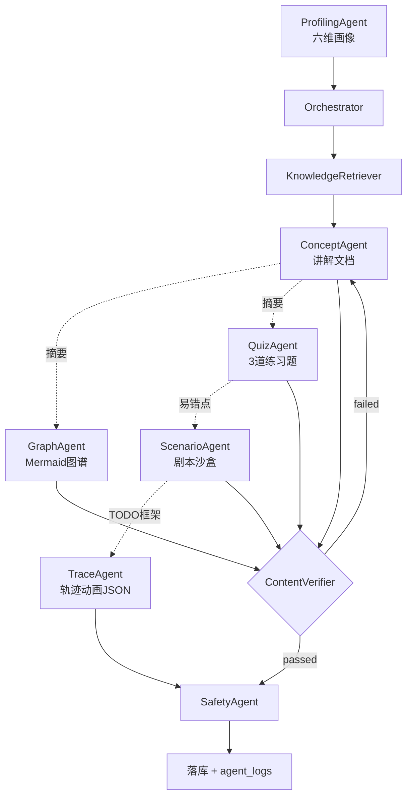
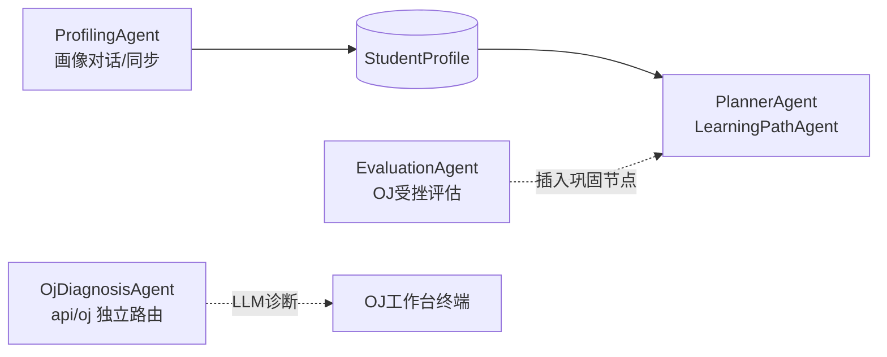

<div align="center">

# AlgoPilot · 算法领航者

### 基于大模型多智能体协作的算法自适应教育平台

**Multi-Agent Driven Algorithm Learning Sandbox**

> 产品品牌 **AlgoPilot**；界面与 API 标题当前显示为 **「算法智能学习平台」**（同一系统）。

<br/>

[](https://vuejs.org/)
[](https://fastapi.tiangolo.com/)
[](https://www.python.org/)
[](https://www.typescriptlang.org/)

<br/>

AlgoPilot 将 **代码执行轨迹追踪（Trace Engine）** 与 **大模型多智能体编排（Orchestrator）** 结合：在 OJ 环境中按行/按帧采集变量快照，经统一 JSON 协议驱动前端动画；同时通过画像、路径 DAG、资源生成与学情降级，支撑高等教育场景下的 **千人千面** 学习引导。

<br/>

[快速开始](#-快速开始-quick-start) ·
[智能体拓扑](#-多智能体集群角色分工与协同-multi-agent-swarm-topology) ·
[Trace 引擎](#-执行轨迹可视化引擎-core-technology) ·
[技术栈](#-技术栈与开源框架致谢-technology-stack--credits) ·
[目录结构](#-仓库目录结构)

</div>

---

## ✨ 核心能力一览

| 能力域 | 关键实现（代码落点） |
|--------|----------------------|
| **对话式画像** | 破冰引导 + `ProfilingAgent` 抽取六维文本与 **1–10 分** → `PersonaRadarChart` |
| **DAG 学习路径** | `LearningPathAgent` 拓扑排序 + 画像分数启发式 + `prerequisites` / `difficulty` |
| **资源铸造** | `CORE_RESOURCE_PIPELINE` 五类资源；RAG → 生成 ⇄ 校验 → `SafetyAgent` |
| **学情自适应** | 连续 3 次 WA/RE/TLE/CE → `EvaluationAgent` 通知 `PlannerAgent` **插入路径巩固节点** |
| **安全** | C++ **静态**危险调用拦截 + LLM 输出 `SafetyAgent` 审查 |
| **轨迹可视化** | Python `settrace` / C++ `gdb_stl_extract` → `oj/trace` 组件族 |

---

## 🤖 多智能体集群角色分工与协同 (Multi-Agent Swarm Topology)

**编排原则**：画像、路径、资源、评估等 LLM 能力统一经 `Orchestrator` 入口调度（`backend/services/orchestrator/`），**禁止业务 API 直连大模型**。  
资源生成阶段的 `agent_logs` 与 SSE 事件回传前端 **Agent Synergy Terminal**（`AgentThinkingConsole.vue`）。

### 资源生成流水线（与代码一致）

下列 DAG 与 `Orchestrator.describe_resource_dag_mermaid()` / `workflow.py` 一致；`generate-all` 按五类资源**依次**生成，Agent 间通过 `PipelineContext` 传递协作摘要（虚线）。



> `trace_animation` 跳过文本校验（`workflow._SKIP_VERIFY_TYPES`），由 TraceAgent 内部对接 Trace Runner。

### 跨模块协同（独立 API，非上图单次调用）



### 核心智能体家族

| 图标 | 展示名 / 代码 ID | 核心职责 |
|:----:|------------------|----------|
| 🎯 | **ProfilerAgent** / `ProfilingAgent` | 自然语言破冰（预设 3 条引导语 + 用户回复）；`sync-from-stored` 抽取 **6 维**特征与量化分，驱动雷达图。 |
| 🗺️ | **PlannerAgent** / `LearningPathAgent` | 依据画像分数与模块进度做 DAG 拓扑排序；步骤含先修边、难度档；受挫时可 **插播巩固模块**（如 DP 受挫回退数组）。 |
| 🏭 | **Generator Swarm** | 五类资源：`document` · `mindmap` · `exercises` · `code_case` · `trace_animation`。 |
| ↳ | `ConceptAgent` | Markdown 讲解文档（流式 SSE）。 |
| ↳ | `GraphAgent` | Mermaid 知识图谱。 |
| ↳ | `QuizAgent` | 个性化 **3 道**练习题（选择/填空）。 |
| ↳ | `ScenarioAgent` | 剧情沙盒 + `// TODO` 代码框架。 |
| ↳ | `TraceAgent` | 轨迹动画 JSON（对接 Trace Runner）。 |
| 🚑 | `EvaluationAgent` | OJ **连续 ≥3 次** 非 AC → `POST /evaluation/oj-struggle` → 触发路径重规划（**非**自动生成教案文件）。 |
| 🛡️ | `SafetyAgent` | 资源正文：敏感词 / 幻觉题号预警 / Prompt 注入粗检；终端输出审查结论。 |
| 🔬 | `OjDiagnosisAgent` | **`/api/oj/.../ai/diagnose`**，不经资源 Orchestrator；边界测例 + Trace + LLM 旁白。 |
| 🔍 | `KnowledgeRetriever` | **Okapi BM25** + 同义词扩展（`knowledge/retriever.py`）。 |
| ✅ | `ContentVerifierAgent` | 对照知识库校验，失败回流重试（最多 2 次）。 |

**C++ 判题安全**：提交前 `check_cpp_security()` 正则拦截 `system` / `fork` / `exec` / 危险头文件等（`utils/security.py`）。当前为静态规则，**未**接入 Docker 进程隔离（见 `backend/docs/OJ.md` 规划项）。

---

## ⚙️ 执行轨迹可视化引擎 (Core Technology)

Trace Engine 是本系统与「纯文本教案生成」差异化的底层能力。

### 技术原理

| 语言 | 机制 | 实现文件 |
|------|------|----------|
| **Python** | `sys.settrace` 行级钩子 | `services/oj/trace_runner.py`（子进程隔离执行） |
| **C++** | GDB + `gdb_stl_extract.py`（Pretty-Printers 提取 STL） | `services/oj/cpp_trace_runner.py`；失败时正则回退并归一化 |

API 注释中的「GDB MI」为历史表述；**推荐路径**为注入 GDB Python 脚本提取 `vector` / `stack` / `queue` / `deque` / `map` 等结构。

### 协议与前端（`trace_viz`）

| 类型 | 说明 | 前端组件目录 |
|------|------|----------------|
| `sequence` + `view_hint` | 栈/队列/向量等 | `frontend/src/components/oj/trace/` |
| `associative` | map / set 等 | 同上 |
| `matrix` / `linked_list` / `tree` | 专用可视化 | `TraceMatrixGrid` / `TraceLinkedList` / `TraceTreePanel` 等 |

矩阵高亮：前端对比相邻两步 `cells` 做 Diff，**无需**后端逐格写入 `changed`。

### AI 诊断（独立管线）

```
WA 代码 → ai/diagnose（OjDiagnosisAgent）
  → 边界微测例 + 判题 + Trace 录制
  → changed 精简序列 → LLM 根因与 bug_step_index
```

协议说明：`backend/docs/trace_viz_schema.md`。

### 演示旁白（有限 Mock）

`trace_demo_narration.py` 为**部分题目**（如 `reverse-linked-list`、`unique-paths`）提供**无 LLM** 的规则旁白，在 Trace 成功且未生成 LLM 旁白时兜底。  
**不能**替代画像对话、五类资源生成或 AI 诊断（后者依赖 API Key）。

---

## 🛠️ 技术栈与开源框架致谢 (Technology Stack & Credits)

以下为仓库**实际依赖**（见 `frontend/package.json`、`backend/requirements.txt`）。

### 前端

| 技术 | 用途 |
|------|------|
| [Vue 3](https://vuejs.org/) + [Vite 8](https://vitejs.dev/) | UI 与构建 |
| [TypeScript](https://www.typescriptlang.org/) ~6.x | 类型系统 |
| [Vue Router 4](https://router.vuejs.org/) | 路由 |
| [Element Plus](https://element-plus.org/) | 组件库 |
| [CodeMirror 6](https://codemirror.net/) | OJ 编辑器 |
| [Mermaid](https://mermaid.js.org/) | 思维导图展示 |
| [Axios](https://axios-http.com/) | HTTP |
| [Pinia](https://pinia.vuejs.org/) | 全局状态（auth / persona / learningPath） |
| [@vue-flow/core](https://vueflow.dev/) | 概念知识图谱交互可视化 |

样式为 **CSS 变量 + Element Plus 暗色/浅色切换**（顶栏一键切换），未使用 TailwindCSS。

### 后端

| 技术 | 用途 |
|------|------|
| [FastAPI](https://fastapi.tiangolo.com/) + [Uvicorn](https://www.uvicorn.org/) | API / ASGI |
| [Pydantic v2](https://docs.pydantic.dev/) | Schema |
| [SQLAlchemy 2](https://www.sqlalchemy.org/) | ORM（默认 SQLite `backend/data/alp_learning.db`） |
| [httpx](https://www.python-httpx.org/) | 异步调用大模型 API |
| [pytest](https://docs.pytest.org/) + [ruff](https://docs.astral.sh/ruff/) | 单元测试与 lint（`backend/tests/`） |

### 运行时与模型

| 组件 | 用途 |
|------|------|
| CPython `sys.settrace` | Python 追踪 |
| MinGW `g++` / `gdb` | C++ 编译与 STL 追踪（**可选**，未安装时 C++ Trace/OJ 能力受限） |
| [讯飞星火 Spark](https://www.xfyun.cn/doc/spark/X1-http.html) **OpenAI 兼容** HTTP | 默认 `lite`（Spark Lite），见 `backend/.env.example` |
| python-jose · bcrypt | JWT 与密码哈希 |

---

## 🚀 快速开始 (Quick Start)

### Docker 一键演示（推荐 · 现场答辩）

需安装 [Docker Desktop](https://www.docker.com/products/docker-desktop/)：

```bash
docker compose up --build
```

| 服务 | 地址 |
|------|------|
| 前端（Nginx） | http://localhost:8080 |
| 后端 API | http://localhost:9000/api/health |

> 大模型 Key 仍通过 `backend/.env` 配置；未配置时 Trace / OJ / 静态资源可用，画像与资源生成需 API。

### 一键启动（Windows 本地开发）

根目录双击：

```text
start.bat
```

自动执行：`npm install` → `pip install` → 启动后端（默认 `http://127.0.0.1:9000`，端口占用时可能改用 `9010`）与前端（`http://127.0.0.1:5173`）。

### 测试与 CI

```powershell
cd backend
pip install -r requirements-dev.txt
pytest -q --cov=services
```

GitHub Actions（`.github/workflows/ci.yml`）在 push/PR 时自动执行：后端 **Ruff + pytest 覆盖率**、前端 **vue-tsc 构建**、**docker compose build**。

### 工程化增强（对标竞赛最佳实践）

| 能力 | 说明 |
|------|------|
| **画像指纹增量生成** | `generate-all` 比对 persona/主题指纹，未变则复用已有五类资源（SSE `reused`） |
| **Quiz strict 校验** | `schemas/agent_outputs.py` + Pydantic `extra=forbid` |
| **概念图社区发现** | `concept_clusters.py` 标签传播 → 路径规划弱簇优先 |
| **Fuse 模糊搜索** | 资源库标题/正文拼写容错 |
| **画像 UI 密度** | `usePersonaUiProvider` 全局注入，弱基础隐藏多智能体入口、精简 Workflow 日志 |
| **Trace 树懒展开** | 大树默认折叠深层，点击再渲染 |

### 手动启动

<details>
<summary><b>后端</b></summary>

```powershell
cd backend
python -m venv .venv
.\.venv\Scripts\Activate.ps1
pip install -r requirements.txt
copy .env.example .env
uvicorn main:app --reload --host 127.0.0.1 --port 9000
```

</details>

<details>
<summary><b>前端</b></summary>

```powershell
cd frontend
npm install
npm run dev
```

</details>

### 环境变量（`backend/.env`）

| 变量 | 必填 | 说明 |
|------|:----:|------|
| `JWT_SECRET` | 是 | 登录会话签名 |
| `SPARK_API_PASSWORD` | 演示 LLM 功能时 | 控制台 APIPassword；画像、资源生成、AI 诊断、助教 |
| `SPARK_MODEL` | 否 | 默认 `lite`（Spark Lite） |
| `DATABASE_URL` | 否 | 默认 SQLite，见 `.env.example` 注释 |

### 功能与环境依赖对照

| 功能 | 依赖 | 无 API Key / 无 gdb 时 |
|------|------|-------------------------|
| 登录、进度、OJ 样例运行 | 后端 + 判题 | Python 题一般可用 |
| 画像对话、资源生成、AI 诊断 | `SPARK_API_PASSWORD` | **不可用** |
| Python Trace | CPython | **可用** |
| C++ STL Trace | `g++` + `gdb` | 受限或失败 |
| Trace 规则旁白 | 特定 slug | **部分题目**可用（见 `trace_demo_narration.py`） |
| 路径受挫降级 | 登录 + 连续 3 次非 AC | 需登录；调用 `/evaluation/oj-struggle` |

### 建议演示路径（约 5 分钟）

1. 配置 `backend/.env` 后启动；**注册/登录**。
2. **我的学习 → 学习画像**：回复 3 轮 → 自动/手动同步画像 → 雷达图 → 可选重排路径。
3. **学习路径**：查看推荐顺序、DAG 先修、难度与巩固节点提示。
4. **Agent 工作台**（`/agent-workbench`）：批量生成资源 → 终端查看 `SafetyAgent` 等日志。
5. **OJ 练习**：连续 WA → **AI 诊断**（需 Key）→ 终端 Evaluator/Planner 日志；**可视化 Trace**（Python 题推荐）。
6. 可选：**STL 可视化操场**（`/playground/stl`）纯前端 Mock，不依赖 gdb。

---

## 📁 仓库目录结构

```text
A3/
├── README.md
├── start.bat
├── backend/
│   ├── main.py
│   ├── api/                    # orchestrator · oj · auth …
│   ├── services/
│   │   ├── agents/             # Profiling / LearningPath / Evaluation …
│   │   ├── orchestrator/       # workflow · core
│   │   ├── oj/                 # 判题 · trace_runner · ai_diagnosis · trace_demo_narration
│   │   ├── safety/             # SafetyAgent · content_filter
│   │   └── knowledge/          # BM25 retriever
│   └── docs/trace_viz_schema.md
└── frontend/
    └── src/
        ├── components/persona/
        ├── components/learning/
        ├── components/agents/          # AgentThinkingConsole
        ├── components/oj/trace/        # 轨迹可视化组件
        └── views/AgentWorkbenchView.vue
```

---

## 📄 许可与声明

根目录暂未附带开源许可证文件；若需二次分发请联系作者或维护方确认授权方式。

---

<div align="center">

**AlgoPilot（算法智能学习平台）** — 让可观测的执行轨迹，成为个性化教学的共同语言。

</div>
