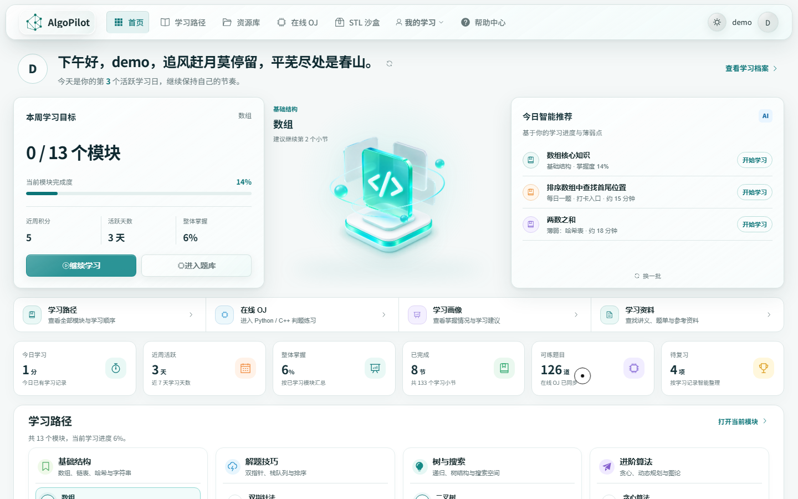
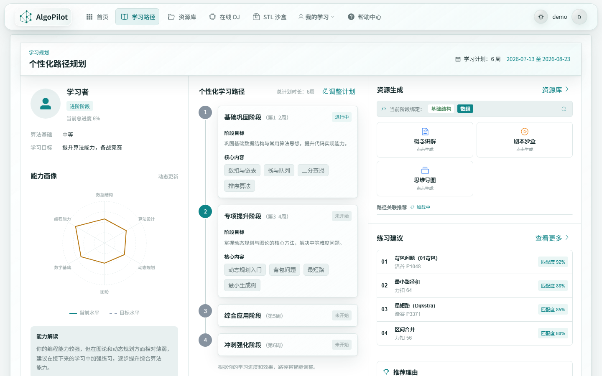
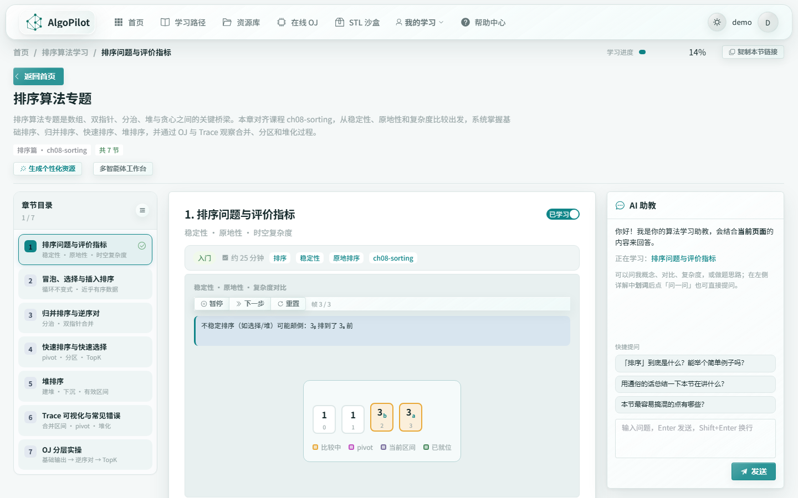
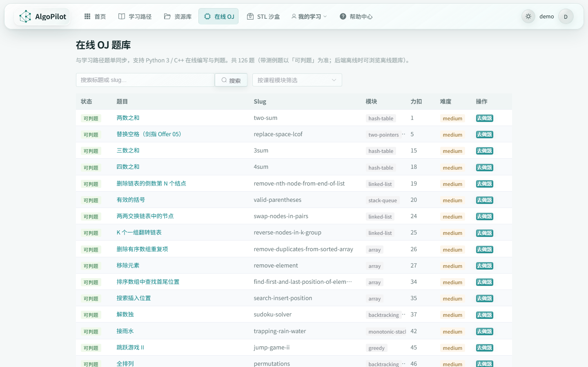
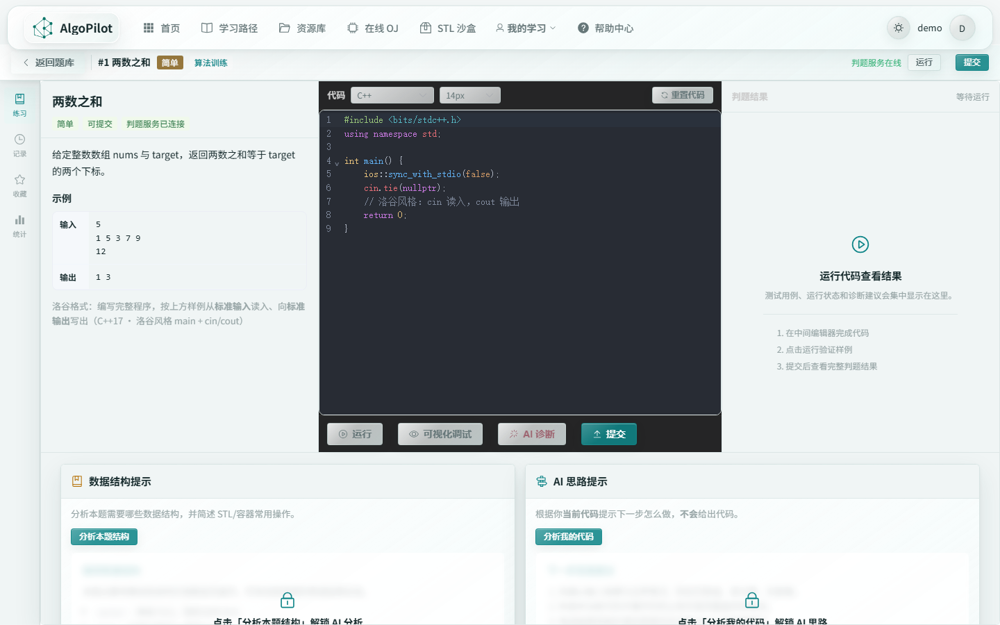
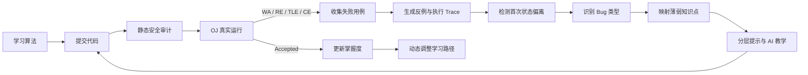
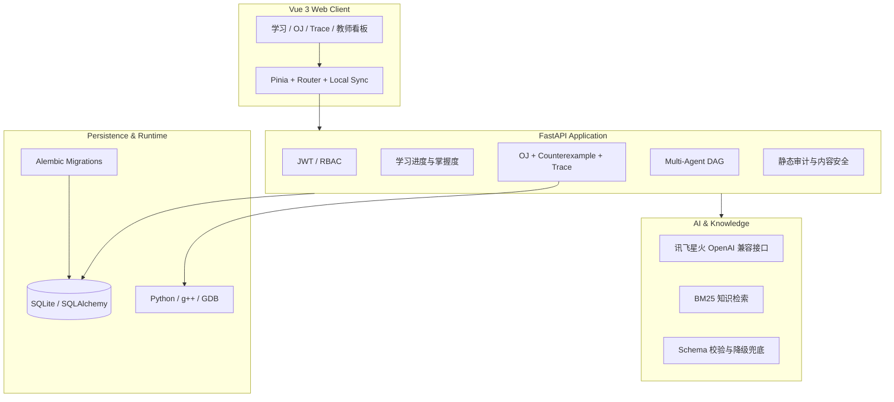

<div align="center">

# 🧭 AlgoPilot

### 基于真实执行证据的智能算法学习与代码诊断平台

从「只告诉你 Wrong Answer」，走向「用失败用例、变量轨迹与首次状态偏离解释为什么错」。

[](https://github.com/GhostYEH/AlgoPilot/actions/workflows/backend-tests.yml)
[](https://github.com/GhostYEH/AlgoPilot/actions/workflows/frontend-checks.yml)


[功能亮点](#-功能亮点) · [界面预览](#-界面预览) · [系统架构](#-系统架构) · [快速开始](#-快速开始) · [测试](#-测试与质量保障)

</div>



---

## ✨ 项目简介

AlgoPilot 是一个贯穿「学、练、测、诊、改、评」的算法学习平台。它把算法课程、动态学习路径、在线 OJ、Python / C++ 执行 Trace、反例生成、AI 分层提示、知识掌握度与教师学情分析串成一条完整闭环。

平台最核心的区别不是“接入了一个聊天模型”，而是要求诊断建立在**真实程序执行证据**之上：学生代码会被实际编译或运行，系统收集失败测试、运行时变量、控制流变化和首次异常位置，再据此解释错误并推荐下一步学习内容。

> **核心理念：** AI 可以负责讲解，但事实必须来自可验证的执行结果。

### 为什么需要 AlgoPilot？

| 常见学习体验 | AlgoPilot 的处理方式 |
| --- | --- |
| OJ 只返回 `Wrong Answer` | 展示失败用例、实际输出、执行轨迹与疑似错误位置 |
| AI 只看代码文本，容易猜错 | 诊断必须引用 `ExecutionEvidence` 结构化证据 |
| 提示过早泄露答案 | 使用 L1 → L2 → L3 分层提示，逐步增加信息量 |
| 做错一道题，却不知道弱在哪 | 将 Bug 类型映射到算法知识点与学生掌握状态 |
| 所有人获得同一条学习路线 | 根据画像、进度、薄弱点和近期行为动态规划路径 |
| 教师只能看到最终分数 | 汇总班级进度、风险学生、薄弱知识点与 OJ 表现 |

---

## 🚀 功能亮点

### 1. Execution Evidence Engine｜程序执行证据引擎

统一汇聚静态分析、OJ 判题、失败用例、Python / C++ Trace、首次状态偏离和 AI 诊断，生成可追溯的 `ExecutionEvidence`。每条诊断不仅有结论，还包含证据来源、置信度与关联代码位置。

### 2. First Divergence Detection｜首次状态偏离

系统使用 Semantic Trace Alignment v2 对比学生执行轨迹与合理参考轨迹：除变量状态与事件序列外，还结合源码行角色和静态控制流上下文完成重对齐，并从实际执行落点识别分支、循环走向。已验证 AC 会先按算法结构聚类，每个策略群选择 medoid 作为 canonical solution，再从与学生策略最接近的群中选择参考解。系统会定位**第一次发生异常的步骤**，给出代码行、关键变量、学生状态和参考状态之间的差异；没有可信参考轨迹时返回原因，不伪造分析结果。

### 3. Counterexample Generator｜反例生成器

当提交出现 WA 时，系统会从空输入、单元素、极值、重复、有序、逆序等边界类别中寻找能够稳定暴露 Bug 的输入，并通过真实运行验证候选反例。

### 4. Bug Taxonomy｜错误分类与知识点映射

诊断覆盖边界错误、循环条件、索引偏移、状态更新、数据结构误用等 9 类错误模式。错误会进一步映射到算法知识点，参与掌握度更新与后续学习路径调整。

### 5. 个性化学习路径

平台根据学习者画像、章节完成度、薄弱知识点和近期表现生成阶段化路径，提供能力雷达、资源推荐、练习建议与计划调整依据。

### 6. 13 个可交互算法模块

覆盖数组、链表、哈希表、字符串、双指针、栈与队列、排序、二叉树、回溯、贪心、动态规划、单调栈与图论。模块内包含动态演示、章节任务、AI 助教与配套 OJ。

### 7. Python / C++ 在线 OJ 与 Trace

内置 126 道可判题目，支持 Python 3 与 C++17、CodeMirror 代码编辑、样例运行、正式提交、执行轨迹、STL 容器提取、AI 思路提示与诊断报告。

### 8. 多智能体资源生成与教师端

22 个注册节点分布在画像、资源、路径、辅导、安全和评估 6 个层级。学生端可生成讲解、思维导图、练习、代码案例、Trace 动画、PPT 和视频脚本；教师端提供班级总览、学生花名册、风险提醒、OJ 分析与教学资源工作台。

---

## 🖼️ 界面预览

### 个性化学习路径

能力画像、阶段目标、资源生成与练习推荐在同一条学习路线中联动。



### 可交互算法讲义

章节目录、逐步动画、学习状态和 AI 助教协同工作，让抽象过程可以被观察和操作。



### 在线 OJ 题库

题库与学习模块同步，支持按标题、Slug 和算法模块检索与筛选。



### OJ 做题与诊断工作台

题面、编辑器、运行结果、数据结构提示、AI 思路提示和 Trace 诊断集中在一个工作区。



> 截图来自本仓库本地运行页面，使用 `demo` 测试账号中的实际学习数据拍摄，并非设计稿或静态示意图。

---

## 🔄 核心学习闭环



完整链路中的关键产物会写入数据库：提交记录、执行轨迹、Bug 记录、提示记录与学生知识状态。相同证据通过 `(submission_id, evidence_type)` 做幂等控制，避免重复诊断导致掌握度被多次更新。

---

## 🏗️ 系统架构



### 多智能体分层

| 层级 | 代表节点 | 职责 |
| --- | --- | --- |
| `profiling` | `ProfilingAgent` | 六维动态学生画像 |
| `resource` | `ConceptAgent`、`GraphAgent`、`TraceAgent`、`ExerciseAgent` | 生成讲解、图谱、动画与练习资源 |
| `path` | `PlannerAgent`、`LearningPathAgent` | 学习路径 DAG 规划与调整 |
| `tutor` | `TutorAgent`、`OjAssistantAgent`、`OjDiagnosisAgent` | 学习答疑、刷题提示与深度诊断 |
| `safety` | `ASTAnalyzerAgent`、`SafetyAgent`、`ContentVerifierAgent` | 代码熔断、内容安全与防幻觉校验 |
| `eval` | `MasteryAgent`、`EvaluationAgent`、`EventBus` | 掌握度、效果评估与事件闭环 |

编排核心为项目内自主实现的轻量 DAG，不依赖 LangGraph。LLM 不可用时，画像、资源生成和诊断链路具备模板或规则降级能力。

---

## 🧰 技术栈

| 领域 | 技术 |
| --- | --- |
| 前端框架 | Vue 3.5、TypeScript 6、Vite 8、Pinia 3、Vue Router 4 |
| UI 与动效 | Element Plus、GSAP、CSS 动画 |
| 数据可视化 | D3.js、Three.js、Mermaid、Vue Flow |
| 代码编辑器 | CodeMirror 6（Python / C++） |
| 后端 | Python 3.13、FastAPI、Pydantic 2、SQLAlchemy 2 |
| 数据库 | SQLite、Alembic；通过 `DATABASE_URL` 可切换兼容数据库 |
| AI | 科大讯飞星火 OpenAI 兼容接口、结构化输出校验、规则降级 |
| 检索 | BM25 RAG、同义词扩展、课程知识库 |
| OJ / Trace | Python subprocess、g++、GDB MI、STL 容器提取 |
| 测试与 CI | pytest、TypeScript 契约测试、GitHub Actions |

### 当前仓库规模

| 项目 | 数量 |
| --- | ---: |
| 算法学习模块 | 13 |
| OJ 题目 | 126 |
| 注册编排节点 | 22 |
| Vue 页面 | 24 |
| Vue 组件 | 81 |
| 前端 API 模块 | 15 |
| 后端 API 模块 | 18 |
| SQLAlchemy 数据模型 | 12 |
| Alembic 迁移版本 | 4 |

---

## ⚡ 快速开始

### 环境要求

- Python 3.13+
- Node.js 20.19+ 或 22.12+ 与 npm（CI 当前使用 Node.js 25）
- Windows 推荐安装 g++ 与 GDB，以启用完整 C++ 判题和 Trace
- 一个现代浏览器

> 仅体验课程、路径和基础学习功能时可以暂不配置 LLM；AI 画像、资源生成与深度诊断需要有效的讯飞星火密钥。

### 方式一：Windows 一键启动

项目目录若已包含 `runtime/python` 与 `runtime/nodejs` 便携运行时，可直接执行：

```powershell
.\启动.bat
```

脚本会安装依赖、选择可用后端端口、启动 FastAPI 与 Vite，并持续保持两个服务运行。关闭窗口或按 `Ctrl+C` 即可停止。

### 方式二：手动启动（推荐开发者使用）

#### 1. 克隆项目

```powershell
git clone https://github.com/GhostYEH/AlgoPilot.git
cd AlgoPilot
```

#### 2. 配置并启动后端

```powershell
cd backend
Copy-Item .env.example .env

py -3.13 -m venv .venv
.\.venv\Scripts\Activate.ps1
python -m pip install -r requirements.txt
python -m uvicorn main:app --reload --host 127.0.0.1 --port 9000
```

#### 3. 在另一个终端启动前端

```powershell
cd frontend
npm install
npm run dev
```

#### 4. 打开服务

| 服务 | 地址 |
| --- | --- |
| Web 前端 | <http://127.0.0.1:5173/> |
| 后端 API | <http://127.0.0.1:9000/> |
| Swagger API 文档 | <http://127.0.0.1:9000/docs> |
| 健康检查 | <http://127.0.0.1:9000/api/health> |

### 打包前端并由后端托管

```powershell
cd frontend
npm run build

cd ..\backend
python -m uvicorn main:app --host 127.0.0.1 --port 9000
```

当 `frontend/dist` 存在时，FastAPI 会托管构建后的 SPA，此时可直接访问 <http://127.0.0.1:9000/>。

---

## 🔐 配置说明

后端开发模式读取 `backend/.env`。建议从示例文件复制后再填写，不要提交真实密钥。

```dotenv
JWT_SECRET=替换为足够长的随机字符串
JWT_EXPIRE_MINUTES=10080

# 可选，默认写入 backend/data/alp_learning.db
# DATABASE_URL=sqlite:///./data/alp_learning.db

# AI 功能
SPARK_API_PASSWORD=你的星火_APIPassword
SPARK_MODEL=lite

# 可选：在线语音合成
IFLYTEK_TTS_APP_ID=你的讯飞_APPID
IFLYTEK_TTS_API_KEY=你的讯飞_APIKey
IFLYTEK_TTS_API_SECRET=你的讯飞_APISecret
TTS_VOICE=x4_xiaoyan
```

<details>
<summary><strong>常用环境变量</strong></summary>

| 变量 | 默认值 | 说明 |
| --- | --- | --- |
| `APP_ENV` | `development` | 环境类型：`development` / `test` / `production` |
| `DATABASE_URL` | SQLite | SQLAlchemy 数据库连接串 |
| `JWT_SECRET` | 开发占位值 | 生产环境必须替换 |
| `SPARK_API_PASSWORD` | 空 | 讯飞星火 API Password |
| `SPARK_MODEL` | `lite` | 星火模型名称 |
| `SPARK_TIMEOUT` | `90` | 非流式请求超时秒数 |
| `SPARK_STREAM_TIMEOUT` | `180` | 流式请求超时秒数 |
| `CORS_ORIGINS` | 本地开发地址 | 逗号分隔的允许源 |
| `OJ_MAX_CODE_CHARS` | `20000` | 单次提交最大代码字符数 |
| `OJ_RUN_REQUESTS_PER_MINUTE` | `20` | 普通判题限流 |
| `OJ_AI_REQUESTS_PER_MINUTE` | `5` | AI 诊断限流 |

</details>

### 数据库迁移

应用启动时会自动升级数据库结构，也可以在维护窗口显式执行：

```powershell
cd backend
python -m alembic upgrade head
```

---

## 🗂️ 项目结构

```text
AlgoPilot/
├── backend/
│   ├── api/                 # FastAPI 路由：认证、学习、OJ、教师端等
│   ├── core/                # 配置、数据库与启动迁移
│   ├── data/oj/             # 126 道题的目录与测试数据
│   ├── knowledge/           # 课程讲义、实验与综合项目
│   ├── knowledge_base/      # BM25 检索数据与知识图谱
│   ├── migrations/          # Alembic 版本化迁移
│   ├── models/              # SQLAlchemy 数据模型
│   ├── schemas/             # Pydantic 输入输出模型
│   ├── services/
│   │   ├── agents/          # 多智能体节点与注册表
│   │   ├── evidence/        # Execution Evidence 构建与持久化
│   │   ├── mastery/         # 掌握度计算与知识状态更新
│   │   ├── oj/              # 判题、Trace、反例与诊断
│   │   ├── orchestrator/    # 轻量 DAG 编排核心
│   │   └── safety/          # 内容安全与防幻觉校验
│   └── tests/               # pytest 测试
├── frontend/
│   ├── src/api/             # 类型化 API 请求
│   ├── src/components/      # 通用、学习、OJ、画像与资源组件
│   ├── src/modules/         # 13 个算法学习模块
│   ├── src/stores/          # Pinia 状态管理
│   ├── src/utils/           # Trace、学习同步与契约工具
│   └── src/views/           # 学生端、教师端与 OJ 页面
├── docs/images/             # README 实机截图
├── evaluation/              # 12 项系统评测指标与运行器
├── .github/workflows/       # 前后端 CI 与定时慢测试
└── 启动.bat                 # Windows 一键启动脚本
```

---

## ✅ 测试与质量保障

### 后端

```powershell
cd backend
python -m pip install -r requirements.txt -r requirements-dev.txt

python scripts/ci_test_runner.py fast      # 快速测试
python scripts/ci_test_runner.py migrate   # 迁移测试
python scripts/ci_test_runner.py slow      # 真实 subprocess / LLM 慢测试
python scripts/ci_test_runner.py all       # 全部测试
```

### 前端

```powershell
cd frontend
npm run typecheck
npm run build
npm run test:oj-struggle
npm run test:path-replan-diff
npm run test:graph-module
npm run test:structured-json
npm run test:exec-evidence
```

### 最近一次本地验证

| 检查项 | 结果 | 验证环境 |
| --- | --- | --- |
| Backend fast suite | **149 passed，18 slow deselected** | Windows 11 / Python 3.13.7 |
| Frontend typecheck | **通过** | TypeScript 6 / vue-tsc 3 |
| Frontend production build | **通过** | Vite 8.0.13 |
| Frontend contract tests | **52 项通过** | Node.js 25.8.1 |

> 验证日期：2026-08-31。慢测试包含真实代码执行、编译和可选外部 LLM 调用，运行前请确认本机工具链与密钥配置。

CI 会在 `main` / `develop` / 当前默认开发分支 `algpilot-core-loop` 的 push，以及面向 `main` / `develop` 的 pull request 中运行前后端检查；外部依赖较重的 slow suite 由定时任务或手动工作流执行。

### 系统评测框架

```powershell
python -m evaluation.run_eval --json results.json --csv results.csv
```

评测覆盖 Bug 定位 Top-1 / Top-3 准确率、Bug 分类准确率、反例触发率、AI 幻觉率、证据覆盖率、修复成功率、提示使用、重复 Bug 比率和 P50 / P95 / P99 延迟。详见 [evaluation/README.md](evaluation/README.md)。

---

## 🧯 常见问题

<details>
<summary><strong>Vite 提示 Port 5173 is in use</strong></summary>

Vite 默认允许自动切换到下一个端口，因此实际地址可能变为 `http://127.0.0.1:5174/`。请以终端中 `Local:` 后显示的地址为准。

检查占用进程：

```powershell
Get-NetTCPConnection -State Listen -LocalPort 5173 |
  Select-Object LocalAddress, LocalPort, OwningProcess
```

确认目标确实是旧的本项目进程后，再通过任务管理器或 `Stop-Process -Id <PID>` 停止它。

</details>

<details>
<summary><strong>前端出现 ECONNREFUSED 127.0.0.1:9000</strong></summary>

首次启动时后端需要完成数据库迁移，前端可能比后端更早发起健康检查。若稍后出现 `backend OK`，通常只是启动时序导致的一次性错误；也可以直接访问 `/api/health` 确认状态。

若 9000 被其他服务占用，一键脚本会尝试 9010 或 9080，并写入前端本地代理配置。

</details>

<details>
<summary><strong>AI 功能提示未配置</strong></summary>

确认 `backend/.env` 中的 `SPARK_API_PASSWORD` 不是示例占位符，并重启后端。未配置密钥时，基础学习和 OJ 仍可使用，部分 AI 链路会进入模板或规则降级。

</details>

<details>
<summary><strong>C++ 判题或 Trace 不可用</strong></summary>

确认 `g++ --version` 与 `gdb --version` 可在终端执行，并查看 <http://127.0.0.1:9000/api/health> 中的 `cpp_compiler` 与 `trace_cpp` 字段。

</details>

---

## 🛡️ 安全边界

- JWT + RBAC 控制学生、教师与管理能力；学生数据身份从 Token 获取，不接受客户端伪造 `user_id`。
- 提交代码先经过静态审计，再使用无 `shell=True` 的参数列表启动子进程，并设置时间、输出与代码长度限制。
- LLM 输出经过 JSON Schema 校验、有限重试、内容安全检查与降级处理。
- 真实密钥和本地数据库已由 `.gitignore` 排除，禁止将 `.env` 提交到仓库。
- **内置代码执行器只适用于受控本机开发。** 当前版本在 `APP_ENV=production` 时会主动拒绝以宿主机 subprocess 模式启动；公网部署前必须接入独立隔离的 sandbox worker。

---

## 🗺️ Roadmap

- [ ] 独立 Docker / microVM OJ sandbox worker
- [ ] Java Trace 与更多语言支持
- [ ] Property-based Testing 与更强反例缩减
- [ ] 教师端批量作业、班级与课程管理
- [ ] 知识图谱交互和路径解释进一步增强
- [ ] 前端大体积依赖按场景继续拆包

---

## 📜 License

Copyright © 2026 AlgoPilot. All rights reserved.

本项目为**专有软件**，未经版权持有人书面许可，不得复制、修改、分发、再许可或使用本软件及其源代码。第三方依赖仍分别遵循其各自许可证，详情见 [LICENSE](LICENSE)。

<div align="center">

**让每一次 Wrong Answer，都成为下一次真正理解的起点。**

Made with 🧠, evidence and a lot of test cases.

</div>
