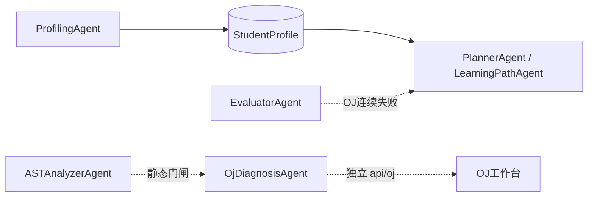

# 多智能体架构说明（AlgoPilot / A3）

> 与根目录 `README.md` 中 Mermaid DAG 对齐；代码落点以本仓库当前实现为准。

## 1. 编排框架

采用 **Orchestrator + Workflow DAG**（与 LangGraph 同构：状态节点、有向边、条件分支），**所有 LLM 调用**经 `services/llm/client.py`，**API 层禁止直连大模型**。

| 层级 | 模块 | 职责 |
|------|------|------|
| 入口 | `api/orchestrator.py` | HTTP/SSE、鉴权、请求体验证 |
| 编排 | `services/orchestrator/core.py` | 画像 / 路径 / 资源 / 评估 / 助教路由 |
| 单资源流水线 | `services/orchestrator/workflow.py` | RAG → 生成 ⇄ 校验 → Safety → 元数据 |
| 协作上下文 | `services/orchestrator/pipeline_context.py` | 批量生成时跨 Agent 摘要传递 |
| 注册表 | `services/agents/registry.py` | Agent 元数据与资源类型映射 |
| 角色实现 | `services/agents/resource_roles.py` | 五类资源角色 Agent |

### 与 LangChain / LangGraph 的关系

当前为 **自研轻量 DAG**（零 `langgraph` 依赖、易部署）。节点语义与 `StateGraph` 一致，可表述为「LangGraph 同构实现」；后续若引入 `langgraph`，宜保留 `ResourceRoleAgent` / `Orchestrator` 接口不变。

---

## 2. 智能体注册表（按 layer）

| layer | Agent ID | 职责 | 调度入口 |
|-------|----------|------|----------|
| profiling | `ProfilingAgent` | 对话破冰、六维画像抽取、`patch-from-learning` | `Orchestrator.persona_*` |
| resource | `ConceptAgent` | 讲解文档（Domain/Structure JSON） | `resource_type=document` |
| resource | `GraphAgent` | Mermaid 知识图谱 | `mindmap` |
| resource | `ScenarioAgent` | 剧本沙盒 + TODO 代码框架 | `code_case` |
| resource | `TraceAgent` | 题解 Trace JSON（对接 `trace_runner`） | `trace_animation` |
| path | `PlannerAgent` / `LearningPathAgent` | DAG 路径规划、受挫插入巩固节点 | `replan_learning_path` |
| tutor | `TutorAgent` | 流式答疑（画像 + 知识上下文） | `tutor/chat/stream` |
| tutor | `OjAssistantAgent` | OJ 刷题辅导 | `oj/assistant` |
| tutor | `OjDiagnosisAgent` | WA 深度诊断（**独立** `api/oj` 路由） | `ai/diagnose` |
| safety | `KnowledgeRetriever` | Okapi BM25 + 同义词扩展 | `workflow` 首阶段 |
| safety | `ContentVerifierAgent` | 对照知识库校验，失败回流重试 | `workflow` |
| safety | `SafetyAgent` | 敏感词 / 幻觉题号 / Prompt 注入 | `workflow` 末段 |
| safety | `ASTAnalyzerAgent` | 静态死循环/越界熔断（**非**资源 Orchestrator） | `static_audit` / OJ 门闸 |
| eval | `EvaluationAgent` | 学习效果多维度评估 | `POST /evaluation` |
| eval | `EvaluatorAgent` | OJ 连续 ≥3 次失败 → 通知 Planner | `POST /evaluation/oj-struggle` |

### 旧名称兼容

| 旧 ID / 类型 | 现行映射 |
|--------------|----------|
| `DocAgent` | `ConceptAgent`（`document` / `reading`） |
| `MindMapAgent` | `GraphAgent`（`mindmap`） |
| `CodeAgent` | `ScenarioAgent`（`code_case`） |
| `VideoAgent` | `TraceAgent`（`video_script` / `trace_animation`） |

---

## 3. 资源生成 Pipeline

### 3.1 单资源 DAG（`workflow.py`）

```
KnowledgeRetriever (BM25)
    → role_agent 生成（携带 PipelineContext 协作摘要）
    → ContentVerifierAgent（trace_animation / video_script 跳过）
    → SafetyAgent
    → Orchestrator 落库（meta 含 agent_logs）
```

- 校验失败：最多重试 `MAX_VERIFY_RETRIES = 2` 次，仍失败则 `status=draft` 但可通过安全审查后落库。
- 安全未通过：抛出 `ValueError`，不落库。

### 3.2 批量五类资源（`generate-all`）

阶段拓扑定义于 `schemas/resources.py` → `PARALLEL_PHASES`：

| Phase | 资源类型 | 并行 | 依赖 |
|-------|----------|------|------|
| 1 | `document` | 否 | — |
| 2 | `mindmap` | 否 | Phase 1 的 `doc_summary` |
| 3 | `code_case` | 否 | Phase 1 的 `doc_summary` |
| 4 | `trace_animation`, `reading` | **是** | `scenario_hook` |

**并发与一致性**

- `PipelineContext`：`log` / `update_from_resource` / `agent_hints_block` 均为同步方法；在 asyncio 单线程下，`await` 之间原子执行，不同资源写不同字段（`doc_summary` / `graph_outline` / …），无写冲突。
- **数据库**：并行阶段每个 `_run_phase_task` 使用 **独立** `SessionLocal()`，避免共享请求级 Session 并发 `commit`。
- **SSE**：`collaboration` 事件仅推送 **增量** `agent_logs`，避免前端终端重复刷屏。

### 3.3 SSE 事件类型

| type | 含义 |
|------|------|
| `progress` | 阶段开始（含 `parallel: true` 标记） |
| `workflow` | 单资源流水线阶段（rag / generate / verify / safety） |
| `collaboration` | 协作日志增量 |
| `resource` | 单类资源落库完成 |
| `error` | 单类失败（批量模式可 `partial_failure`） |
| `done` | 全部结束，`agent_logs` 为全量汇总 |

---

## 4. 跨模块协同（非单次 generate-all）



- **EvaluatorAgent** 与 **EvaluationAgent** 为两个角色：前者仅 OJ 受挫降级，后者为综合学情评分。
- **OjDiagnosisAgent** 不经资源 Orchestrator，走 `POST /api/oj/problems/{slug}/ai/diagnose`。

---

## 5. TraceAgent 行为说明

| 项 | 行为 |
|----|------|
| Prompt 输出 | JSON：`code` / `stdin` / `stdout` / `narration_hint` |
| 生成后 | `generate()` 内调用 `trace_runner.run_trace_stdio` 录制步骤 |
| 校验 | `trace_animation` 在 `_SKIP_VERIFY_TYPES` 中，**跳过** ContentVerifier 文本回流 |
| 安全 | 仍走 SafetyAgent；trace JSON 过长会被截断 |
| 协作输出 | `PipelineContext.trace_hint` ← `narration_hint` + 步数 |
| 失败兜底 | LLM 无 code 时使用内置求和模板，`verdict=PENDING` |

静态审计 **不** 经过 TraceAgent：由 `ASTAnalyzerAgent` 在 run/trace/diagnose 前统一门闸（`services/oj/static_audit.py`）。

---

## 6. 防幻觉与安全

| 机制 | 模块 |
|------|------|
| RAG | `services/knowledge/retriever.py` + `knowledge_base/chunks.json` |
| 校验闭环 | `services/agents/verifier.py` |
| 内容安全 | `services/safety/content_filter.py`（`SafetyAgent.audit`） |
| C++ 提交 | `check_cpp_security()` 正则（`utils/security.py`） |

---

## 7. HTTP 入口一览

| 方法 | 路径 | 说明 |
|------|------|------|
| POST | `/api/orchestrator/persona/chat` | 画像对话 SSE |
| POST | `/api/orchestrator/persona/sync` | 画像 JSON 入库 |
| POST | `/api/orchestrator/resources/generate` | 单类资源（`?stream=true` SSE） |
| POST | `/api/orchestrator/resources/generate-all` | 五类批量 SSE |
| POST | `/api/orchestrator/learning-path/replan` | 路径重规划 |
| POST | `/api/orchestrator/evaluation` | 学情评估 |
| POST | `/api/orchestrator/evaluation/oj-struggle` | OJ 受挫 → Planner |
| GET | `/api/orchestrator/agents` | 注册表 + pipeline + mermaid |

---

## 8. 集成测试

无 LLM 依赖的批量管线冒烟测试：

```bash
cd backend
python -m scripts.test_generate_all_integration
```

覆盖：四阶段拓扑、五类落库、协作摘要传递、SSE 增量日志、并行 Session 隔离。
