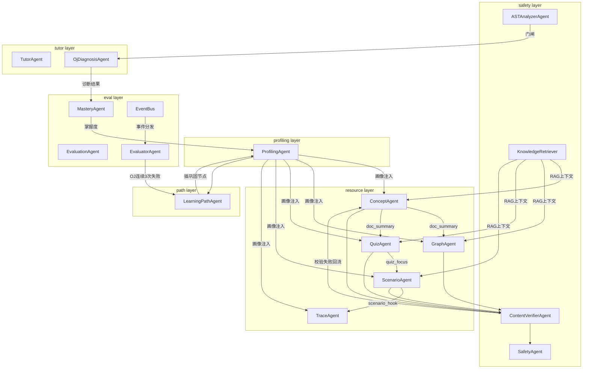

# AlgoPilot 系统开发说明书

> 文档版本：v1.2 · 适用赛题：A3 · 更新日期：2026-07-16
> 对应代码版本：`a493bb03df876313eb57f6d5425abed8de745901`（提交前需随最终代码重新确认）
> 文档状态：提交候选版

---

## 一、总体架构

### 1.1 架构总览

AlgoPilot 采用 **前后端分离 + 多智能体编排** 的三层架构：

```
┌─────────────────────────────────────────────────────────┐
│                     前端（Vue 3 + TS）                     │
│  Element Plus · CodeMirror · Mermaid · D3 · Vue Flow     │
│  23 个页面视图 · 74 个通用组件 · 13 个算法游戏 · 13 个 Trace 组件 │
└────────────────────────┬────────────────────────────────┘
                         │ HTTP / SSE / Axios
┌────────────────────────▼────────────────────────────────┐
│                   后端（FastAPI + Python）                │
│  ┌──────────┐  ┌───────────┐  ┌──────────┐  ┌─────────┐ │
│  │ API 层   │→ │ 编排层    │→ │ Agent 层 │→ │  LLM 层 │ │
│  │ 16 路由  │  │Orchestrator│  │ 22 注册  │  │  星火   │ │
│  │ 66 端点  │  │            │  │ 20 实现  │  │         │ │
│  └──────────┘  └───────────┘  └──────────┘  └─────────┘ │
│  └── 20 个已实现 Agent，2 个规划中扩展节点（PptAgent/VideoScriptAgent）
│  ┌──────────┐  ┌───────────┐  ┌──────────┐  ┌─────────┐ │
│  │ RAG 检索 │  │ OJ 判题   │  │ 安全层   │  │ 数据层  │ │
│  │ BM25     │  │ Python/C++│  │ AST/正则 │  │SQLite   │ │
│  └──────────┘  └───────────┘  └──────────┘  └─────────┘ │
└─────────────────────────────────────────────────────────┘
```

### 1.2 分层职责

| 层级 | 技术栈 | 职责 |
|------|--------|------|
| **前端展示层** | Vue 3 + TypeScript + Element Plus | 用户交互、可视化呈现、状态管理、路由守卫 |
| **API 接口层** | FastAPI + Pydantic | HTTP/SSE 端点、JWT 鉴权、请求校验、依赖注入 |
| **编排层** | 自研 DAG Orchestrator | Agent 调度、资源生成流水线、协作上下文管理 |
| **Agent 层** | 22 个注册条目（20 个已实现 + 2 个规划中扩展节点，6 layer） | 画像抽取、资源生成、路径规划、辅导答疑、安全校验、学情评估 |
| **LLM 层** | 讯飞星火（OpenAI 兼容） | 所有 LLM 调用收口，流式 + 非流式 |
| **RAG 知识层** | Okapi BM25 + 课程 Markdown | 知识检索、同义词扩展、上下文构建 |
| **OJ 判题层** | subprocess + AST + g++/gdb | Python/C++ 判题、Trace 追踪、静态审计 |
| **安全层** | AST 分析 + 正则 + 内容审查 | 死循环熔断、危险调用拦截、幻觉检测、Prompt 注入防护 |
| **数据层** | SQLAlchemy 2.0 + SQLite/MySQL | 8 张表、外键级联、JSON 字段、会话管理 |

### 1.3 目录结构

```
AlgoPilot/
├── start.bat                    # Windows 一键启动
├── backend/                     # 后端
│   ├── main.py                  # FastAPI 入口（16 路由注册、CORS、SPA fallback）
│   ├── core/
│   │   ├── config.py            # Settings（星火、TTS、JWT、CORS、数据库）
│   │   └── database.py          # SQLAlchemy engine / SessionLocal / Base
│   ├── api/                     # 16 个 API 路由模块
│   │   ├── auth.py / deps.py    # 认证（JWT + bcrypt）
│   │   ├── orchestrator.py      # 多智能体编排入口
│   │   ├── oj.py / oj_admin.py / oj_assistant.py  # OJ
│   │   ├── ai_tutor.py / tts.py # AI 助教与 TTS
│   │   └── learning.py / memory.py / mastery.py / events.py ...
│   ├── models/db_models.py      # 8 个 ORM 表
│   ├── schemas/                 # 20 个 Pydantic schema 模块
│   ├── services/                # 业务服务层（核心）
│   │   ├── agents/              # 多智能体实现（20 个已实现 + 2 个规划中扩展节点）
│   │   ├── orchestrator/        # 编排层（core / workflow / pipeline_context）
│   │   ├── llm/client.py        # 星火 LLM 客户端
│   │   ├── knowledge/           # RAG 知识库检索
│   │   ├── oj/                  # OJ 判题与 Trace 引擎（22 个文件）
│   │   ├── safety/              # 内容安全
│   │   ├── skills/              # 技能卡推荐
│   │   ├── mastery/             # 掌握度评估
│   │   ├── memory/              # 学习记忆
│   │   └── teacher_dashboard/   # 教师看板
│   ├── knowledge_base/          # 知识库（chunks.json + 章节 README）
│   ├── knowledge/courses/       # 课程级 Markdown（14 章 + 6 实验 + 2 项目）
│   ├── data/oj/                 # OJ 题库数据
│   ├── tests/                   # 32 个测试文件
│   └── docs/                    # 4 份架构文档
├── frontend/                    # 前端
│   └── src/
│       ├── api/                 # 16 个 API 调用模块
│       ├── components/          # 74 个 Vue 组件
│       │   ├── agents/          # 多智能体协作可视化
│       │   ├── learning/        # 学习组件（24 个）
│       │   ├── oj/              # OJ 组件（13 个 + trace/ 13 个）
│       │   ├── persona/         # 画像组件
│       │   └── resources/       # 资源组件
│       ├── composables/         # 22 个组合式函数
│       ├── modules/             # 14 个算法模块 + games/ 13 个游戏
│       ├── stores/              # Pinia 状态（auth、learningPath、persona）
│       ├── utils/               # 50+ 工具函数
│       └── views/               # 23 个页面视图
└── docs/submission/             # 本提交文档
```

---

## 二、前后端技术栈

### 2.1 后端技术栈

| 类别 | 技术 | 版本 | 用途 |
|------|------|------|------|
| Web 框架 | FastAPI | ≥0.115.0 | 异步 API、自动文档、依赖注入 |
| ASGI 服务器 | uvicorn[standard] | ≥0.32.0 | 开发与生产运行 |
| 数据校验 | Pydantic | ≥2.0.0 | Schema 定义与校验 |
| 配置管理 | pydantic-settings | ≥2.0.0 | .env 环境变量加载 |
| ORM | SQLAlchemy | ≥2.0.0 | 数据库映射（声明式） |
| 数据库 | SQLite（默认）/ MySQL | — | 零配置启动 / 生产可切换 |
| 认证加密 | python-jose[cryptography] | ≥3.3.0 | JWT 签发与验证 |
| 密码哈希 | bcrypt | ≥4.0.0 | 用户密码加密存储 |
| HTTP 客户端 | httpx | ≥0.27.0 | 调用星火 API |
| WebSocket | websocket-client | ≥1.6.0 | 讯飞流式 TTS |
| YAML 解析 | PyYAML | ≥6.0.0 | 课程 manifest 与技能卡 |
| 邮箱校验 | email-validator | ≥2.0.0 | 注册邮箱格式校验 |
| 表单解析 | python-multipart | ≥0.0.9 | 文件上传与表单 |
| 加密库 | cryptography | ≥41.0.0 | JWT 底层依赖 |

### 2.2 前端技术栈

| 类别 | 技术 | 版本 | 用途 |
|------|------|------|------|
| 框架 | Vue 3 | ^3.5.34 | 响应式 UI（Composition API） |
| 语言 | TypeScript | ~6.0.2 | 类型安全 |
| 路由 | vue-router | ^4.6.4 | SPA 路由 + 守卫 |
| 状态管理 | Pinia | ^3.0.4 | 全局状态（auth、learningPath、persona） |
| UI 库 | Element Plus | ^2.14.0 | 组件库 |
| 图标 | @element-plus/icons-vue | ^2.3.2 | 图标 |
| 代码编辑器 | CodeMirror 6 + vue-codemirror | ^6.0.2 | OJ 代码编辑 |
| 代码语言 | @codemirror/lang-python / lang-cpp | ^6.0.3 | 语法高亮 |
| 主题 | @codemirror/theme-one-dark | ^6.1.3 | 暗色主题 |
| 图表可视化 | Mermaid | ^11.15.0 | 思维导图与流程图 |
| 数据可视化 | D3.js | ^7.9.0 | 自定义可视化 |
| DAG 可视化 | @vue-flow/core | ^1.48.2 | 学习路径 DAG |
| HTTP | axios | ^1.16.1 | API 调用 |
| 模糊搜索 | fuse.js | ^7.3.0 | 题库搜索 |
| 构建工具 | Vite | ^8.0.12 | 开发服务器与打包 |
| 类型检查 | vue-tsc | ^3.2.8 | Vue 类型校验 |
| 自动导入 | unplugin-auto-import / unplugin-vue-components | ^21.0.0 | 自动导入 API 与组件 |

### 2.3 开发与测试工具

| 工具 | 版本 | 用途 |
|------|------|------|
| pytest | ≥8.0.0 | 后端单元/集成测试 |
| pytest-asyncio | ≥0.24.0 | 异步测试支持 |
| pytest-cov | ≥5.0.0 | 覆盖率统计 |
| ruff | ≥0.8.0 | Python lint |
| GitHub Actions | — | CI/CD（后端 pytest + 前端 build） |
| PyInstaller | — | 打包为本地可执行程序（COLLECT 模式目录形态） |

---

## 三、数据库设计

### 3.1 数据库选型

- **默认**：SQLite（`backend/data/alp_learning.db`），零配置启动，适合课程演示
- **可切换**：MySQL（通过 `DATABASE_URL` 环境变量配置），适合生产部署
- **连接配置**：SQLite 使用 `check_same_thread=False`，MySQL 使用 `pool_pre_ping=True` + `pool_recycle=3600`

### 3.2 E-R 关系图

```
users (1)
  ├── (1:1) learning_progress
  ├── (1:1) student_profiles
  ├── (1:N) generated_resources
  ├── (1:1) learning_path_plans
  ├── (1:N) student_learning_memories
  ├── (1:N) learning_event_logs
  └── (1:N) oj_submissions
```

所有表均以 `user_id` 外键关联 `users.id`，`ondelete="CASCADE"` 级联删除。

### 3.3 表结构详解

#### 表 1：users（用户表）

| 字段 | 类型 | 约束 | 说明 |
|------|------|------|------|
| id | Integer | PK, autoincrement | 用户 ID |
| username | String(64) | UNIQUE, INDEX | 用户名 |
| email | String(255) | UNIQUE, NULLABLE | 邮箱 |
| hashed_password | String(255) | NOT NULL | bcrypt 哈希密码 |
| role | String(16) | DEFAULT 'student' | 角色：student / teacher |
| created_at | DateTime | DEFAULT now() | 注册时间 |

#### 表 2：learning_progress（学习进度）

| 字段 | 类型 | 约束 | 说明 |
|------|------|------|------|
| user_id | Integer | PK, FK→users.id | 用户 ID |
| payload | JSON | NOT NULL | 各模块学习进度（替代 localStorage） |
| updated_at | DateTime | DEFAULT now(), ON UPDATE now() | 更新时间 |

#### 表 3：student_profiles（学生画像）

| 字段 | 类型 | 约束 | 说明 |
|------|------|------|------|
| user_id | Integer | PK, FK→users.id | 用户 ID |
| summary | String(2000) | DEFAULT '' | 画像摘要 |
| dimensions | JSON | NOT NULL | 六维画像数据 |
| chat_history | JSON | NOT NULL | 画像对话历史 |
| updated_at | DateTime | DEFAULT now(), ON UPDATE now() | 更新时间 |

**六维画像维度**（`dimensions` JSON 结构）：
1. 知识基础（knowledge_base）
2. 认知风格（cognitive_style）
3. 代码实操能力（coding_proficiency）
4. 学习目标（learning_goal）
5. 易错点偏好（error_patterns）
6. 抗挫折心理（resilience）

#### 表 4：generated_resources（多智能体生成的资源）

| 字段 | 类型 | 约束 | 说明 |
|------|------|------|------|
| id | Integer | PK, autoincrement | 资源 ID |
| user_id | Integer | FK→users.id, INDEX | 用户 ID |
| resource_type | String(32) | INDEX | 资源类型（document/mindmap/exercises/code_case/trace_animation/reading） |
| agent_name | String(64) | NOT NULL | 生成 Agent 名称 |
| title | String(256) | NOT NULL | 资源标题 |
| content | String(50000) | DEFAULT '' | 资源内容（JSON 或 Markdown） |
| meta | JSON | NOT NULL | 元数据（含 agent_logs、verification、source 等） |
| created_at | DateTime | DEFAULT now() | 创建时间 |

#### 表 5：learning_path_plans（学习路径计划）

| 字段 | 类型 | 约束 | 说明 |
|------|------|------|------|
| user_id | Integer | PK, FK→users.id | 用户 ID |
| summary | String(500) | DEFAULT '' | 路径摘要 |
| rationale | String(2000) | DEFAULT '' | 规划理由 |
| next_module_key | String(64) | NULLABLE | 下一个推荐模块 |
| ordered_keys | JSON | NOT NULL | 有序模块键列表 |
| steps | JSON | NOT NULL | 详细步骤列表 |
| progress_snapshot | JSON | NOT NULL | 进度快照 |
| updated_at | DateTime | DEFAULT now(), ON UPDATE now() | 更新时间 |

#### 表 6：student_learning_memories（学习记忆）

| 字段 | 类型 | 约束 | 说明 |
|------|------|------|------|
| id | Integer | PK, autoincrement | 记忆 ID |
| user_id | Integer | FK→users.id, INDEX | 用户 ID |
| course_id | String(64) | DEFAULT 'data_structures_algorithms', INDEX | 课程 ID |
| chapter_id | String(80) | DEFAULT '', INDEX | 章节 ID |
| skill_id | String(64) | DEFAULT '', INDEX | 技能 ID |
| problem_slug | String(128) | DEFAULT '', INDEX | 题目 slug |
| event_type | String(32) | INDEX | 事件类型 |
| observed_error_pattern | String(500) | DEFAULT '' | 观察到的错误模式 |
| trace_summary | String(2000) | DEFAULT '' | Trace 摘要 |
| failed_strategy | String(500) | DEFAULT '' | 失败策略 |
| successful_hint | String(500) | DEFAULT '' | 成功提示 |
| mastery_delta | Integer | DEFAULT 0 | 掌握度变化 |
| evidence_json | JSON | NOT NULL | 证据 JSON |
| created_at | DateTime | DEFAULT now(), INDEX | 创建时间 |
| updated_at | DateTime | DEFAULT now(), ON UPDATE now() | 更新时间 |

#### 表 7：learning_event_logs（学习事件日志）

| 字段 | 类型 | 约束 | 说明 |
|------|------|------|------|
| event_id | String(32) | PK | 事件 ID（UUID） |
| user_id | Integer | FK→users.id, INDEX | 用户 ID |
| event_type | String(64) | INDEX | 事件类型 |
| course_id | String(64) | DEFAULT 'data_structures_algorithms', INDEX | 课程 ID |
| chapter_id | String(80) | DEFAULT '' | 章节 ID |
| skill_id | String(64) | DEFAULT '' | 技能 ID |
| payload | JSON | NOT NULL | 事件载荷 |
| handled_by | JSON | NOT NULL | 处理该事件的 Agent 列表 |
| status | String(16) | DEFAULT 'pending', INDEX | 处理状态 |
| agent_logs | JSON | NOT NULL | Agent 处理日志 |
| handler_errors | JSON | NOT NULL | 处理错误 |
| created_at | DateTime | DEFAULT now(), INDEX | 创建时间 |

#### 表 8：oj_submissions（OJ 提交记录）

| 字段 | 类型 | 约束 | 说明 |
|------|------|------|------|
| id | Integer | PK, autoincrement | 提交 ID |
| user_id | Integer | FK→users.id, INDEX | 用户 ID |
| problem_slug | String(128) | NOT NULL, INDEX | 题目 slug |
| language | String(16) | NOT NULL | 提交语言（python / cpp） |
| code | Text | NOT NULL | 提交代码 |
| verdict | String(16) | NOT NULL, INDEX | 判定结果（AC / WA / TLE / RE / CE） |
| passed | Integer | DEFAULT 0 | 通过测例数 |
| total | Integer | DEFAULT 0 | 总测例数 |
| duration_ms | Integer | DEFAULT 0 | 执行耗时（毫秒） |
| error_message | String(2000) | DEFAULT '' | 错误信息（截断） |
| created_at | DateTime | DEFAULT now(), INDEX | 提交时间 |

> 该表为 2026-07-16 代码实证的第 8 张表，对应 `backend/models/db_models.py` 中 `OjSubmission` 类。教师看板 OJ 学情分析与学生 OJ 受挫检测均依赖此表。

### 3.4 数据归属与隔离设计

**核心原则**：所有学生侧接口从 JWT 获取用户身份，服务端**不接受**客户端指定 `user_id`。

实现方式：
- `api/deps.py` 中的 `get_current_user` 依赖从 JWT 解析 user_id
- 所有学生侧 API 使用 `current_user.id` 作为查询条件
- 前端退出登录时清理本地学习缓存，避免设备切换账号混入

---

## 四、多智能体架构

### 4.1 编排框架

采用 **Orchestrator + Workflow DAG**（借鉴状态图与 DAG 编排思想，自主实现轻量级多智能体工作流：状态节点、有向边、条件分支），**所有 LLM 调用**经 `services/llm/client.py`，**API 层禁止直连大模型**。

| 层级 | 模块 | 职责 |
|------|------|------|
| 入口 | `api/orchestrator.py` | HTTP/SSE、鉴权、请求体验证 |
| 编排 | `services/orchestrator/core.py` | 画像/路径/资源/评估/助教路由 |
| 单资源流水线 | `services/orchestrator/workflow.py` | RAG → 生成 ⇄ 校验 → Safety → 元数据 |
| 协作上下文 | `services/orchestrator/pipeline_context.py` | 批量生成时跨 Agent 摘要传递 |
| 注册表 | `services/agents/registry.py` | Agent 元数据与资源类型映射 |
| 角色实现 | `services/agents/resource_roles.py` | 6 类资源角色 Agent |

**与 LangChain/LangGraph 的关系**：系统借鉴状态图与 DAG 编排思想，自主实现轻量级多智能体工作流（零 langgraph 依赖、易部署）。项目未使用 LangChain、LangGraph，编排通过 Python `asyncio` + `contextvars` 实现。

### 4.2 智能体注册表（22 个注册条目，20 个已实现，6 个 layer）

| layer | Agent ID | 职责 | 调度入口 |
|-------|----------|------|----------|
| **profiling** | ProfilingAgent | 六维画像抽取、patch-from-learning | Orchestrator.persona_* |
| **resource** | ConceptAgent | 讲解文档（Domain/Structure JSON） | resource_type=document |
| **resource** | GraphAgent | Mermaid 知识图谱 | mindmap |
| **resource** | QuizAgent | 5 道个性化题（选择+填空） | exercises |
| **resource** | ScenarioAgent | 剧本沙盒 + TODO 代码框架 | code_case |
| **resource** | TraceAgent | 题解 Trace JSON（对接 trace_runner） | trace_animation |
| **resource** | ReadingAgent | 分层阅读策展 | reading |
| **resource** | PptAgent | 演示文稿生成 | **规划中扩展节点**（仅注册，未实现） | — |
| **resource** | VideoScriptAgent | 教学短视频脚本 | **规划中扩展节点**（仅注册，未实现） | — |
| **path** | PlannerAgent / LearningPathAgent | DAG 路径规划、受挫插巩固节点 | replan_learning_path |
| **tutor** | TutorAgent | 流式答疑（画像 + 知识上下文） | tutor/chat/stream |
| **tutor** | OjAssistantAgent | OJ 刷题辅导 | oj/assistant |
| **tutor** | OjDiagnosisAgent | WA 深度诊断（独立 api/oj 路由） | ai/diagnose |
| **safety** | KnowledgeRetriever | Okapi BM25 + 同义词扩展 | workflow 首阶段 |
| **safety** | ContentVerifierAgent | 对照知识库校验，失败回流重试 | workflow |
| **safety** | SafetyAgent | 敏感词/幻觉题号/Prompt 注入 | workflow 末段 |
| **safety** | ASTAnalyzerAgent | 静态死循环/越界熔断 | static_audit / OJ 门闸 |
| **eval** | EvaluationAgent | 学习效果多维度评估 | POST /evaluation |
| **eval** | EvaluatorAgent | OJ 连续 ≥3 次失败 → 通知 Planner | POST /evaluation/oj-struggle |
| **eval** | MasteryAgent | 章节/技能掌握度可解释评估 | mastery 服务 |
| **eval** | EventBus | 学习事件编排与多智能体闭环 | events 服务 |

### 4.3 Agent 职责与协作关系

#### 4.3.1 节点分类口径

> **节点口径说明**：系统注册 22 个多智能体协作节点，其中 20 个已经具备对应功能或调度实现，PptAgent 和 VideoScriptAgent 为规划中扩展节点（仅注册，未实现）。本节明确各分类与职责，避免将"22 个注册条目"误读为"22 个独立资源生成 Agent"或"22 种学习资源"。

| 分类 | 主要节点 | 职责 | 状态 |
|------|---------|------|------|
| 画像层 | ProfilingAgent | 构建和更新六维动态学生画像 | 已实现 |
| 资源层 | ConceptAgent、GraphAgent、QuizAgent、ScenarioAgent、TraceAgent、ReadingAgent | 生成 5 类核心资源 + 1 类扩展阅读 | 已实现 |
| 路径层 | LearningPathAgent、PlannerAgent | 规划与动态调整个性化学习路径 | 已实现 |
| 辅导层 | TutorAgent、OjAssistantAgent、OjDiagnosisAgent | 学习答疑、OJ 辅导与代码诊断 | 已实现 |
| 安全层 | KnowledgeRetriever、ContentVerifierAgent、SafetyAgent、ASTAnalyzerAgent | 知识检索、内容校验、安全审查与静态熔断 | 已实现 |
| 评估层 | EvaluationAgent、EvaluatorAgent、MasteryAgent、EventBus | 学习效果评估、掌握度计算与事件编排 | 已实现 |
| 扩展节点 | PptAgent、VideoScriptAgent | 演示文稿与短视频脚本生成 | **规划中**（仅注册，未实现） |

#### 4.3.2 协作关系图



### 4.4 资源生成 Pipeline

#### 4.4.1 单资源 DAG

```
KnowledgeRetriever (BM25)
    → role_agent 生成（携带 PipelineContext 协作摘要）
    → ContentVerifierAgent（trace_animation 跳过文本校验，由 trace_runner 内部执行轨迹校验）
    → SafetyAgent
    → Orchestrator 落库（meta 含 agent_logs）
```

- 校验失败：最多重试 `MAX_VERIFY_RETRIES = 2` 次，仍失败则 `status=draft` 但可通过安全审查后落库
- 安全未通过：抛出 `ValueError`，不落库

#### 4.4.2 批量资源生成（generate-all）四阶段拓扑

> **资源类型口径**：系统支持 6 种资源类型，其中 5 种为 A3 赛题核心展示资源（讲解文档、思维导图、分层练习题、代码实操案例、Trace 执行动画），分层拓展阅读为扩展资源。批量生成默认触发全部 6 种资源，按四阶段并行拓扑执行。

| Phase | 资源类型 | 并行 | 依赖 |
|-------|----------|------|------|
| 1 | document | 否 | — |
| 2 | mindmap, exercises | **是** | Phase 1 的 doc_summary |
| 3 | code_case | 否 | quiz_focus |
| 4 | trace_animation, reading | **是** | scenario_hook |

**并发与一致性**：
- `PipelineContext`：`log` / `update_from_resource` / `agent_hints_block` 均为同步方法；在 asyncio 单线程下，`await` 之间原子执行
- 不同资源写不同字段（`doc_summary` / `graph_outline` / `quiz_focus` / `scenario_hook` / `trace_hint`），无写冲突
- 并行阶段每个 `_run_phase_task` 使用**独立** `SessionLocal()`，避免共享 Session 并发 commit

#### 4.4.3 SSE 事件类型

| type | 含义 |
|------|------|
| `progress` | 阶段开始（含 `parallel: true` 标记） |
| `workflow` | 单资源流水线阶段（rag/generate/verify/safety） |
| `collaboration` | 协作日志增量 |
| `resource` | 单类资源落库完成 |
| `error` | 单类失败（批量模式可 `partial_failure`） |
| `done` | 全部结束，`agent_logs` 为全量汇总 |

---

## 五、RAG 知识库

### 5.1 检索算法

采用 **Okapi BM25** 轻量实现（`_BM25Index` 类，k1=1.5, b=0.75），**无向量依赖**，无需 GPU 或嵌入模型。

### 5.2 知识库数据源

| 数据源 | 路径 | 说明 |
|--------|------|------|
| Legacy 切片 | `knowledge_base/chunks.json` | 按模块分块的概念/例题/常见错误/代码模板 |
| 课程级 Markdown | `knowledge/courses/data_structures_algorithms/chapters/` | 14 章课程内容 |
| 实验 | `knowledge/courses/.../labs/` | 6 个实验 |
| 项目 | `knowledge/courses/.../projects/` | 2 个项目 |
| 章节 README | `knowledge_base/{module}/README.md` | 8 个模块说明 |
| 概念图 | `knowledge_base/concept_graph.json` | 概念依赖关系 |
| 教学目标 | `knowledge_base/objectives.json` | 各模块教学目标 |
| 评分标准 | `knowledge_base/rubrics.json` | 评分量规 |

### 5.3 检索流程

```
用户查询
  ↓
_tokenize（中文 2 字 + 英文数字）
  ↓
SYNONYM_MAP 同义词扩展（bst/二叉搜索树、dp/动态规划、哈希/hash 等）
  ↓
BM25 打分 + 加权（module_key +1.5, chapter_id +2.0, course_id +0.5）
  ↓
top_k=4 切片
  ↓
format_context_block（生成 Prompt 上下文块，含防幻觉提示）
  ↓
注入 Agent 生成 Prompt
```

### 5.4 防幻觉设计

- RAG 上下文块包含防幻觉提示："请仅基于以下知识库内容回答，不要编造"
- `build_source_records` 持久化来源记录，可追溯
- ContentVerifierAgent 对照知识库校验生成内容，失败回流重试

---

## 六、星火模型调用

### 6.1 接口说明

采用**讯飞星火 Spark Chat Completions**（OpenAI 兼容接口），所有 LLM 调用收口于 `services/llm/client.py`。

### 6.2 配置参数

| 环境变量 | 默认值 | 说明 |
|---------|--------|------|
| SPARK_API_PASSWORD | （必填） | 星火 API Password |
| SPARK_MODEL | lite | 模型名称 |
| SPARK_CHAT_URL | https://spark-api-open.xf-yun.com/v1/chat/completions | API 地址 |
| SPARK_MAX_TOKENS_LIMIT | 4096 | 单次请求最大 token |
| SPARK_TIMEOUT | 90 | 非流式超时（秒） |
| SPARK_STREAM_TIMEOUT | 180 | 流式超时（秒） |

### 6.3 调用方式

**非流式调用**（`chat_completion`）：
- 用于资源生成、画像抽取、评估等场景
- 返回完整字符串

**流式调用**（`chat_completion_stream`）：
- 用于 AI 助教答疑、画像对话
- `AsyncIterator[str]` 逐段产出 delta
- 通过 SSE 推送到前端

### 6.4 鉴权与错误处理

- 鉴权：`Authorization: Bearer {spark_api_password}`
- 占位符检测：`_is_llm_placeholder` 正则识别"请替换/你的星火/changeme/xxx"等，占位符时 AI 功能不可用并警告
- 错误处理：
  - 超时返回 504
  - 连接错误返回 502
  - 非 200 返回 502 + 截断 500 字符错误信息
  - `_raise_spark_error` 解析星火 error dict
- 未配置时抛 503

### 6.5 调用约束

- **API 层禁止直连 LLM**，必须经 Orchestrator → Agent → llm/client.py
- 所有 Agent 通过 `from services.llm import chat_completion, chat_completion_stream` 调用
- LLM 不可用时，部分 Agent 有模板兜底（如 `template_fallback.py`）

---

## 七、个性化推荐逻辑

### 7.1 画像驱动的个性化

**六维画像** → `_format_profile_block` 格式化为文本 → 注入所有资源生成 Prompt

画像维度：
1. 知识基础（knowledge_base）：已掌握/未掌握的知识点
2. 认知风格（cognitive_style）：视觉型/实践型/理论型
3. 代码实操能力（coding_proficiency）：初级/中级/高级
4. 学习目标（learning_goal）：应试/能力提升/竞赛
5. 易错点偏好（error_patterns）：常见错误模式
6. 抗挫折心理（resilience）：需要鼓励/可直接指出错误

### 7.2 随学随新（patch-from-learning）

`patch_persona_from_learning` 根据学习行为信号更新画像，无需完整对话：
- 输入：weak_module_keys、oj_verdict、consecutive_failures 等
- 输出：画像维度 patch + 更新理由 + 近期证据项
- 实现：`memory_summarizer.py` 构建维度证据链

### 7.3 技能卡推荐

13 张技能卡 YAML 定义于 `services/skills/cards/`：

| 技能卡 | 触发场景 |
|--------|---------|
| backtracking-search | 回溯算法薄弱 |
| binary-search | 二分查找边界错误 |
| complexity-analysis | 复杂度分析不足 |
| dp-state-design | 动态规划状态设计困难 |
| graph-bfs-dfs | 图遍历不熟 |
| greedy-strategy | 贪心策略误用 |
| heap-priority-queue | 堆/优先队列不熟 |
| linear-list-operation | 线性表操作错误 |
| sorting-comparison | 排序比较错误 |
| stack-queue-simulation | 栈/队列模拟困难 |
| string-matching | 字符串匹配问题 |
| tree-traversal | 树遍历错误 |
| union-find | 并查集不熟 |

**推荐流程**：
1. `build_route_request` 构建 SkillRouteRequest（含 module_key、topic、profile_block、oj_verdict、consecutive_failures）
2. `get_skill_router().route(req)` 路由匹配
3. `recommend_skill_cards` 返回最多 3 张卡（primary + matches）
4. `recommend_for_weak_modules` 根据薄弱模块推荐最多 5 张卡

### 7.4 学习路径规划

**LearningPathAgent** 基于：
- 当前画像（六维）
- 学习进度快照
- OJ 表现（通过率、连续失败次数）
- 掌握度报告

生成 DAG 路径：
- `ordered_keys`：有序模块列表
- `steps`：详细步骤（含建议资源类型）
- `rationale`：规划理由
- `next_module_key`：下一个推荐模块

**受挫插巩固节点**：EvaluatorAgent 检测 OJ 连续 ≥3 次失败 → 触发 `oj-struggle` 事件 → EventBus 通知 LearningPathAgent → 在当前路径插入巩固节点。

---

## 八、学习闭环

### 8.1 闭环架构

```
学习行为 → 事件捕获 → EventBus 分发 → Agent 处理 → 画像/记忆/掌握度更新 → 影响下次资源生成
```

### 8.2 闭环关键链路

#### 链路 1：OJ 受挫闭环

```
学生 OJ 提交失败（WA/TLE）
  ↓
consecutive_failures += 1
  ↓
≥3 次？ → EvaluatorAgent 触发 oj-struggle 事件
  ↓
EventBus 分发 → LearningPathAgent
  ↓
路径插入巩固节点 + 推送技能卡
  ↓
学生按提示修正 → AC
  ↓
MasteryAgent 更新掌握度 → ProfilingAgent patch 画像
```

#### 链路 2：资源生成闭环

```
学生请求生成资源
  ↓
KnowledgeRetriever 检索画像相关 + 知识相关内容
  ↓
Agent 生成（注入画像 + RAG 上下文 + 协作摘要）
  ↓
ContentVerifier 校验 → 失败回流重试
  ↓
SafetyAgent 安全审查
  ↓
落库 → 学生学习
  ↓
学习行为记录 → 下次生成时画像更精准
```

#### 链路 3：Trace 诊断闭环

```
学生提交代码 → WA
  ↓
学生点击 Trace 可视化
  ↓
sys.settrace / GDB MI 逐行追踪
  ↓
可视化呈现（链表/树/矩阵等）
  ↓
学生点击 AI 深度诊断
  ↓
OjDiagnosisAgent 生成边界测例 + 复杂度报告
  ↓
错因 + Trace 摘要写入 student_learning_memories
  ↓
下次生成资源时避开类似错误
```

---

## 九、关键数据流

### 9.1 画像对话 → 画像存储 → 路径规划

```
学生发起画像对话（POST /api/orchestrator/persona/chat，SSE 流式）
  ↓
ProfilingAgent 多轮对话抽取六维画像
  ↓
画像 JSON 入库（POST /api/orchestrator/persona/sync → student_profiles 表）
  ↓
LearningPathAgent 基于画像规划 DAG 路径
  ↓
路径入库（learning_path_plans 表）
  ↓
学生访问学习路径页面查看 DAG 可视化
```

### 9.2 资源请求 → RAG 检索 → Agent 生成 → 内容验证 → 安全审查 → 持久化

```
学生请求生成资源（POST /api/orchestrator/resources/generate-all，SSE 流式）
  ↓
KnowledgeRetriever BM25 检索课程知识库（top_k 切片）
  ↓
角色 Agent 生成（注入画像 + RAG 上下文 + PipelineContext 协作摘要）
  ↓
ContentVerifierAgent 对照知识库校验，失败回流重试（最多 2 次）
  ↓
SafetyAgent 安全审查（敏感词、幻觉题号、Prompt 注入）
  ↓
落库（generated_resources 表，meta 含 agent_logs）
  ↓
发布 on_resource_generated 事件
```

### 9.3 OJ 提交 → 判题结果 → 学习事件 → 掌握度更新 → 路径重规划

```
学生提交 OJ 代码（POST /api/oj/problems/{slug}/submit）
  ↓
ASTAnalyzerAgent 静态审计（死循环/越界熔断）
  ↓
runner 执行判题（Python subprocess 或 C++ g++ 编译后执行）
  ↓
返回 verdict（AC/WA/TLE/RE）
  ↓
若失败：consecutive_failures += 1，≥3 次触发 on_oj_submission_failed 事件
  ↓
EventBus 分发 → OjFailurePipeline handler
  ↓
StudentMemory 写入错因 → MasteryAgent 重算掌握度 → 发布 on_mastery_recalculated
  ↓
若掌握度 < 45：LearningPathAgent 在路径中插入巩固节点 → 发布 on_path_adjusted
  ↓
学生按提示修正后 AC → on_oj_submission_accepted → 掌握度提升
```

---

## 十、异常与降级流程

### 10.1 LLM 相关异常

| 异常场景 | 检测方式 | 降级行为 |
|---------|---------|---------|
| 模型无密钥 | `settings.llm_configured` 返回 False | AI 相关 API 返回 503，日志提示"AI 未配置" |
| 模型超时 | httpx 超时（非流式 90s / 流式 180s） | 返回 504 Gateway Timeout |
| 返回空内容 | 响应 content 为空字符串 | 资源生成标记失败，批量模式 partial_failure |
| JSON 解析失败 | Pydantic 校验异常 | ContentVerifier 标记 fail，回流重试；仍失败则 status=draft |
| 占位符密钥 | `_is_llm_placeholder` 正则检测 | AI 功能不可用并警告 |

### 10.2 OJ 与 Trace 异常

| 异常场景 | 检测方式 | 降级行为 |
|---------|---------|---------|
| C++ 编译器不可用 | `g++ --version` 检测失败 | C++ OJ 返回能力不可用提示，Python OJ 正常 |
| GDB 不可用 | `gdb --version` 检测失败 | C++ Trace 返回能力不可用提示，Python Trace 正常 |
| Trace 超时 | CPP_TRACE_SUBPROCESS_CAP_S = 3.0 | 返回超时提示，不阻塞主流程 |
| 死循环代码 | ASTAnalyzerAgent 静态分析 | 执行前熔断，返回 passed=False |
| 危险调用 | check_cpp_security 正则匹配 | 拦截并返回安全提示 |

### 10.3 数据库异常

| 异常场景 | 检测方式 | 降级行为 |
|---------|---------|---------|
| 数据库写入失败 | SQLAlchemy 异常 | 事务回滚，返回 500 错误 |
| 唯一约束冲突 | IntegrityError | 返回 400 Bad Request |
| 数据库连接失败 | OperationalError | 返回 503，提示检查 DATABASE_URL |

---

## 十一、防幻觉与安全机制

系统通过课程知识库检索、结构化输出校验、内容验证、安全审查和有限重试等机制，降低生成幻觉和不合规内容的风险。大模型生成内容仍可能存在错误，重要学术内容应由学生或教师进一步复核。

### 11.1 三重防幻觉防线

| 防线 | 机制 | 实现 |
|------|------|------|
| **第一道：RAG 约束** | BM25 检索课程知识库，约束 LLM 生成范围 | `services/knowledge/retriever.py` |
| **第二道：校验闭环** | ContentVerifierAgent 对照知识库校验生成内容，失败回流重试（最多 2 次） | `services/agents/verifier.py` |
| **第三道：安全审查** | SafetyAgent 检测敏感词、幻觉题号、Prompt 注入 | `services/safety/content_filter.py` |

### 11.2 OJ 执行安全

| 机制 | 实现 | 代码位置 |
|------|------|---------|
| Python 子进程超时 | subprocess.run，默认 3 秒 | `services/oj/runner.py` L266 |
| C++ 危险调用拦截 | 正则匹配 cstdlib/windows.h/system/fork/exec | `utils/security.py` L12-26 |
| AST 静态审计 | 死循环/越界检测，执行前熔断 | `services/oj/static_audit.py` |
| 输出长度限制 | err[:800]、stdout[:400]、Trace 结果 300 字符 | 各 runner |
| Trace 步数上限 | MAX_TRACE_STEPS = 200 | `services/oj/trace_runner.py` |
| C++ Trace 时间上限 | CPP_TRACE_SUBPROCESS_CAP_S = 3.0 | `services/oj/cpp_trace_runner.py` |
| 临时文件清理 | path.unlink(missing_ok=True) | 各 runner |

### 11.3 内容安全

SafetyAgent 审查内容：
- 敏感词检测
- 幻觉题号检测（生成的题号是否在知识库中存在）
- Prompt 注入检测（用户输入是否包含恶意指令）

### 11.4 当前限制与升级路径

当前 OJ/Trace 为课程学习场景的轻量执行环境，**不是生产级公网沙箱**。当前版本主要面向课程实验、竞赛展示和小规模教学试用；若用于正式生产环境，还需进一步完善容器级代码沙箱、并发判题队列、HTTPS、监控告警、数据库备份和高并发支持。已知限制：
- 无进程级资源限制（未设 rlimit）
- 无文件系统隔离
- 无网络隔离
- C++ 静态拦截可被宏展开绕过
- C++ STL Trace 在特定 Windows/GDB 环境下复杂 STL 容器追踪可能触发 3 秒硬上限超时；Python Trace、基础 C++ 判题及普通变量追踪不受该问题影响

生产部署建议：Docker 容器隔离 + 非 root 用户 + 禁止网络 + CPU/内存限制 + 判题队列分离。

---

## 十二、前端架构

### 12.1 路由与守卫

| 路由类型 | 说明 |
|---------|------|
| 公开路由 | /login、/register、/playground |
| 学生路由 | home、learning-path、resources、my-learning、practice 等 |
| 教师路由 | teacher-dashboard、student-roster、oj-analytics、teacher-workbench |
| 学习路由 | 各算法模块学习页（ArrayModuleView 等） |
| 游戏路由 | ModuleGamePlayView |

**路由守卫**：
- 未登录 → 跳转 /login
- 教师访问学生页 → 重定向到 teacher-dashboard
- 学生访问教师页 → 重定向到 home
- 画像 onboarding 门控（学习与练习页无需完成画像）

### 12.2 状态管理

| Store | 职责 |
|-------|------|
| auth | 登录状态、JWT、用户角色 |
| learningPath | 学习路径数据、当前模块 |
| persona | 画像数据、对话历史 |

### 12.3 关键组件

| 组件 | 说明 |
|------|------|
| PersonalizedResourceDashboard | 个性化资源面板 |
| LearningPathRoadmap / LearningPathDagViz | 学习路径可视化 |
| PersonaRadarChart / PersonaEvidenceChain | 画像雷达图与证据链 |
| OjWorkbench | OJ 工作台主组件 |
| CodeEditor | CodeMirror 代码编辑器 |
| CodeTracePanel | Trace 面板 |
| OjAiDiagnosisPanel | AI 诊断面板 |
| 13 个 trace/ 组件 | 链表/树/矩阵/栈/队列等 Trace 可视化 |

### 12.4 构建配置

- 别名 `@` → `./src`
- AutoImport + Components（ElementPlusResolver，自动生成 dts）
- 开发服务器 `127.0.0.1:5173`，代理 `/api` → `http://127.0.0.1:9000`
- 构建分包：element-plus、codemirror、vue-vendor 独立 chunk

---

## 十三、部署架构

### 13.1 开发模式

```
前端 Vite Dev Server (5173) ──proxy──→ 后端 uvicorn (9000) ──→ SQLite
```

### 13.2 打包模式

```
AlgoPilot/（PyInstaller COLLECT 模式打包为目录形态）
  ├── AlgoPilot.exe（启动入口）
  ├── _internal/
  │   ├── frontend/（前端 dist 静态文件）
  │   ├── knowledge_base/
  │   ├── knowledge/courses/
  │   ├── data/oj/
  │   └── .env
  └── 启动后同时提供 API 与前端静态文件（SPA fallback）
```

### 13.3 生产模式（建议）

```
Nginx (HTTPS) ──→ uvicorn (9000) ──→ MySQL
                    ↓
                Docker 判题 Worker（隔离 OJ 执行）
```

---

## 十四、CI/CD

GitHub Actions 配置于 `.github/workflows/ci.yml`：

**后端 job**（ubuntu-latest, Python 3.11）：
- 安装 requirements-dev.txt
- `ruff check`（lint）
- `pytest -q --cov=services --cov-report=term-missing`

**前端 job**（ubuntu-latest, Node 22）：
- `npm ci`
- `npm run typecheck`（vue-tsc 类型检查）
- `npm run build`（vite 生产构建）
- `npm run test:oj-struggle`、`npm run test:path-replan-diff`、`npm run test:graph-module`（3 个工具函数测试脚本）

---

## 十五、相关文档索引

| 文档 | 路径 |
|------|------|
| 多智能体架构说明 | `backend/docs/MULTI_AGENT_ARCHITECTURE.md` |
| OJ 使用说明 | `backend/docs/OJ.md` |
| OJ 安全边界 | `backend/docs/OJ_SECURITY.md` |
| Trace 可视化协议 | `backend/docs/trace_viz_schema.md` |
| 项目 README | `README.md` |
| 环境变量示例 | `backend/.env.example` |
