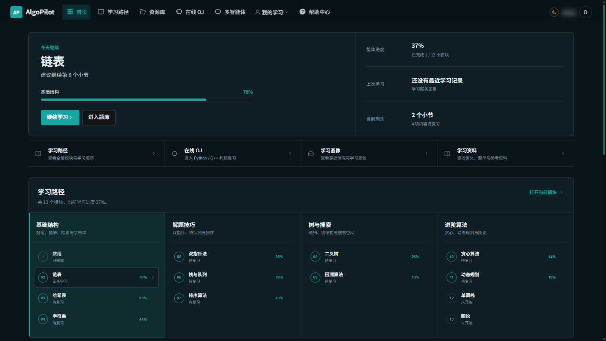
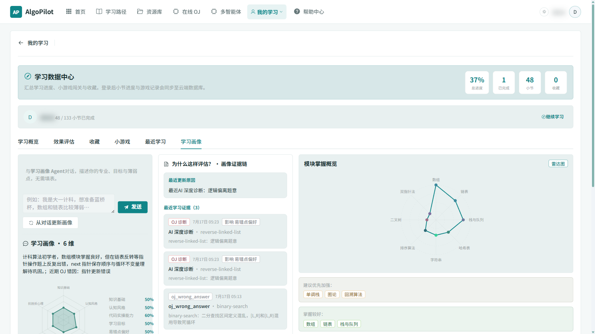
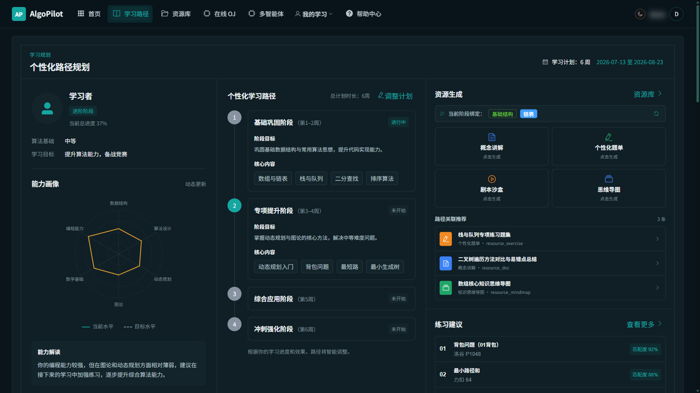
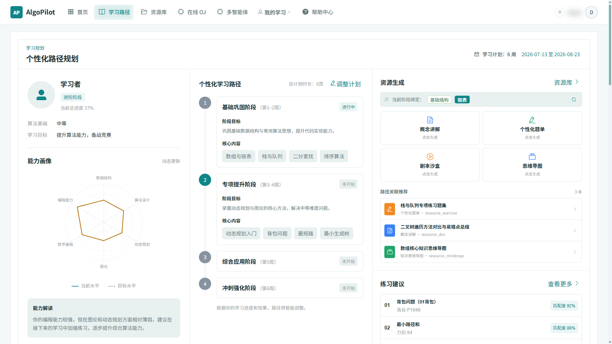
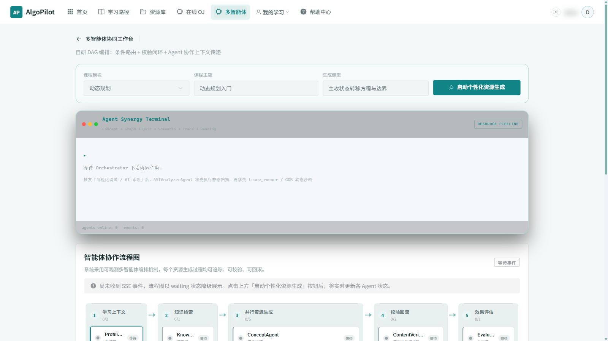
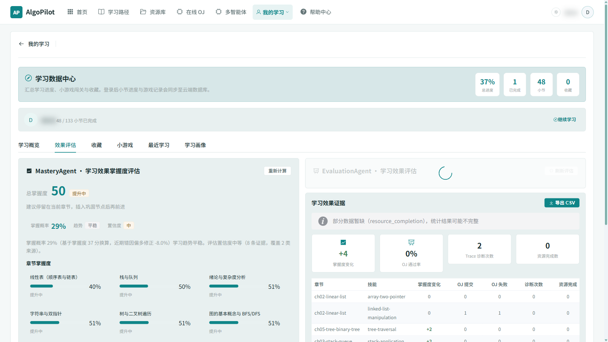
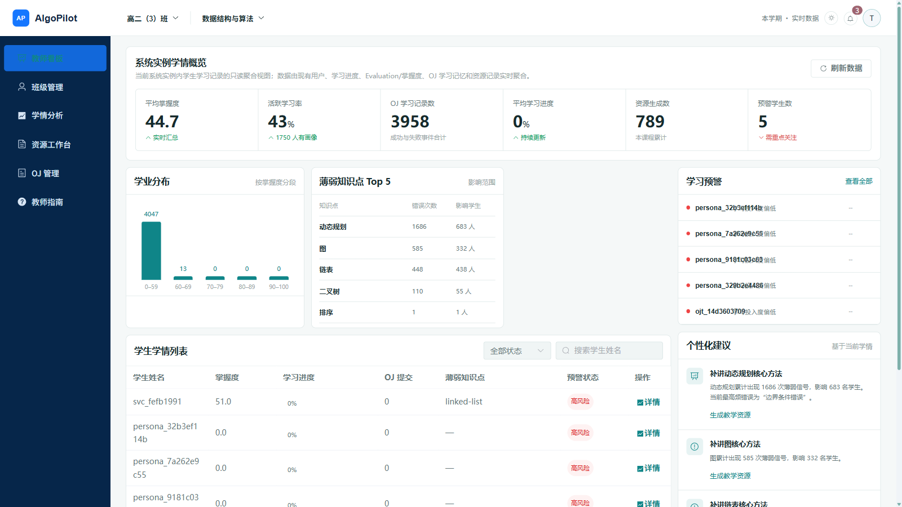

# AlgoPilot 用户操作手册

> 文档版本：v1.2 · 适用赛题：A3 · 更新日期：2026-07-16
> 对应代码版本：`a493bb03df876313eb57f6d5425abed8de745901`（提交前需随最终代码重新确认）
> 文档状态：提交候选版
> 适用对象：学生用户与教师用户
> 访问地址：http://127.0.0.1:5173（开发）或 http://127.0.0.1:9000（打包部署）

> **截图说明**：本手册中的截图位置以「待补截图」任务形式标注（编号 S01-S18）。在正式提交前，请按任务要求在真实运行环境中补齐截图，并将文件保存到 `docs/submission/images/` 目录。每个截图任务包含：建议文件名、插入位置、操作路径、截图内容与隐私要求。截图完成后取消对应 HTML 注释，将图片插入文档。未完成的截图任务集中在第十六章「截图进度表」，正式导出前请删除该章节。

---

## 一、注册与登录

### 1.1 新用户注册

**功能目的**：创建学生或教师账号，获取系统访问权限。

**进入路径**：浏览器打开系统地址 → 点击右上角"注册"。

**操作步骤**：

1. 在注册页面填写以下信息：
   - 用户名（3-64 字符，唯一）
   - 邮箱（可选，仅用于联系，不用于密码找回）
   - 密码（至少 6 位）
   - 角色：选择"学生"或"教师"
2. 点击"注册"按钮
3. 注册成功后自动跳转到登录页面

**预期结果**：注册成功提示并跳转登录页。

**异常处理**：
- 用户名已存在：提示"用户名已被注册"，请更换用户名
- 密码过短：提示"密码至少 6 位"
- 邮箱格式错误：提示"邮箱格式不正确"

**对应截图**：

> **待补截图 S01：登录与注册页面**
>
> - 建议文件名：`images/S01-login.png`
> - 插入位置：本段说明下方
> - 操作路径：浏览器打开系统地址 → 点击"注册" → 完成注册后跳转登录页
> - 截图内容：注册页面与登录页面并排展示，标注用户名、密码、角色选择框位置
> - 隐私要求：不填写真实邮箱与密码；如已登录请先退出

<!-- 截图完成后取消下一行注释：

-->

> **注意**：角色一旦选择无法自行修改，如需更改须由系统维护人员处理。当前版本暂不支持密码找回，请妥善保管密码。

### 1.2 用户登录

**功能目的**：使用已注册账号登录系统。

**进入路径**：点击右上角"登录"。

**操作步骤**：

1. 输入用户名和密码
2. 点击"登录"按钮
3. 登录成功后跳转到首页

**预期结果**：跳转到首页，右上角显示用户名与角色。

**异常处理**：
- 密码错误：提示"用户名或密码错误"
- 用户不存在：提示"用户名或密码错误"（出于安全考虑不区分用户名是否存在）

> **安全提示**：系统使用 JWT 鉴权，所有数据按账号隔离。退出登录时会清理本地缓存，避免设备切换账号时数据混入。

---

## 二、创建学生画像

### 2.1 进入画像对话

**功能目的**：通过多轮自然语言对话，让 ProfilingAgent 抽取学生六维学习画像。

**进入路径**：登录后 → 首页点击"进入画像对话"卡片，或访问"学习路径"页的"新生破冰访谈"区块。

**操作步骤**：

1. 进入画像页面
2. 在输入框中回答 ProfilingAgent 的提问
3. 系统通过 4 轮破冰对话了解学习背景

**预期结果**：每轮对话 SSE 流式返回 AI 回复，对话历史在页面累积显示。

**异常处理**：
- AI 无响应：检查 `SPARK_API_PASSWORD` 是否配置
- 返回 503：LLM 未配置或占位符未替换
- 返回 504：星火 API 超时，可稍后重试

**对应截图**：

> **待补截图 S02：画像多轮对话**
>
> - 建议文件名：`images/S02-persona-chat.png`
> - 插入位置：本段说明下方
> - 操作路径：学生登录 → 点击"创建画像" → 完成 4 轮破冰对话
> - 截图内容：画像对话界面，显示 ProfilingAgent 提问、用户回答与 SSE 流式回复
> - 隐私要求：隐藏用户名、邮箱；对话内容使用示例回答（如"学过 Python 基础"）

<!-- 截图完成后取消下一行注释：

-->

### 2.2 完成画像对话

ProfilingAgent 会通过 4 轮破冰对话了解你的学习背景：

1. **第一轮**：询问编程基础（如"你之前学过哪些编程语言？"）
2. **后续轮次**：依次了解：
   - 认知风格（视觉型/实践型/理论型）
   - 代码实操能力（初级/中级/高级）
   - 学习目标（应试/能力提升/竞赛）
   - 易错点偏好
   - 抗挫折心理

每轮对话支持流式返回（SSE），实时显示 AI 回复。

### 2.3 查看画像结果

**功能目的**：查看 ProfilingAgent 生成的六维学生画像。

**进入路径**：画像对话完成后 → 点击"查看画像"。

**操作步骤**：

1. 点击"查看画像"按钮
2. 查看六维雷达图
3. 查看画像摘要（文字描述）
4. 点击各维度查看证据链

**预期结果**：完整显示六维雷达图、画像摘要与证据链入口。

**异常处理**：
- 画像为空：未完成画像对话，请先完成对话
- 雷达图不显示：刷新页面，或检查画像接口返回数据与浏览器控制台错误日志

**对应截图**：

> **待补截图 S03：六维学生画像结果**
>
> - 建议文件名：`images/S03-persona-result.png`
> - 插入位置：本段说明下方
> - 操作路径：学生登录 → 完成画像对话 → 点击"查看画像"
> - 截图内容：完整显示六维雷达图、画像摘要和证据链入口
> - 隐私要求：隐藏用户名、邮箱及其他个人信息

<!-- 截图完成后取消下一行注释：

-->

**对应截图**：

> **待补截图 S04：画像证据链**
>
> - 建议文件名：`images/S04-persona-evidence.png`
> - 插入位置：本段说明下方
> - 操作路径：画像结果页 → 点击某维度 → 展开证据项
> - 截图内容：画像证据链面板，显示每个维度的判断依据（来自学习行为）
> - 隐私要求：隐藏用户名、邮箱；如证据包含 OJ 提交内容请使用示例代码

<!-- 截图完成后取消下一行注释：

-->

### 2.4 随学随新

画像不是静态的，会随学习行为自动更新：
- OJ 提交结果会 patch 画像
- 学习进度会 patch 画像
- 无需重新对话

---

## 三、查看学习路径

### 3.1 进入学习路径

**功能目的**：查看基于画像生成的个性化学习路径 DAG。

**进入路径**：顶部导航 → "学习路径"。

**操作步骤**：

1. 点击顶部导航"学习路径"
2. 查看 DAG 可视化
3. 查看路径详情面板

**预期结果**：显示个性化路径 DAG 与路径摘要。

**异常处理**：
- 路径为空：未完成画像对话，请先完成画像
- DAG 不显示：刷新页面或检查浏览器 SVG 支持

**对应截图**：

> **待补截图 S05：个性化学习路径**
>
> - 建议文件名：`images/S05-learning-path.png`
> - 插入位置：本段说明下方
> - 操作路径：学生登录 → 完成画像 → 点击"学习路径"
> - 截图内容：LearningPathDagViz 组件，显示多个模块节点与连线，节点颜色区分完成状态
> - 隐私要求：隐藏用户名

<!-- 截图完成后取消下一行注释：

-->

### 3.2 路径可视化

学习路径以 DAG（有向无环图）形式呈现：

- **节点**：每个算法模块（数组、链表、树、图、DP 等）
- **边**：学习顺序依赖
- **颜色**：已完成（绿色）/ 进行中（蓝色）/ 未开始（灰色）/ 巩固节点（橙色）

### 3.3 路径信息

每个路径包含：
- **摘要**：路径总体描述
- **规划理由**：为什么这样规划（基于画像）
- **下一步推荐**：next_module_key
- **进度快照**：各模块完成百分比

### 3.4 路径重规划

**功能目的**：当 OJ 连续 3 次失败时，系统自动在路径中插入"巩固节点"（橙色标记），建议你先复习相关知识点再继续。

**进入路径**：学习路径页 → 点击"重新规划路径"按钮（手动触发）。

**操作步骤**：

1. 完成画像与初始路径规划
2. 在 OJ 中连续提交失败 3 次以上
3. 系统自动触发重规划，插入巩固节点
4. 也可手动点击"重新规划路径"按钮

**预期结果**：路径中出现橙色巩固节点，路径摘要更新。

**异常处理**：
- 重规划失败：检查画像是否已生成
- 巩固节点未出现：确认 OJ 提交已记录到学习事件

**对应截图**：

> **待补截图 S16：学习路径重规划**
>
> - 建议文件名：`images/S16-path-replan.png`
> - 插入位置：本段说明下方
> - 操作路径：学生登录 → 完成 OJ 提交失败 3 次 → 查看路径变化
> - 截图内容：路径 DAG 中出现橙色巩固节点，路径摘要更新
> - 隐私要求：隐藏用户名

<!-- 截图完成后取消下一行注释：

-->

---

## 四、生成学习资源

### 4.1 进入资源生成

**功能目的**：通过多智能体协同生成 6 种学习资源（5 类核心 + 1 类扩展阅读）。

**进入路径**：顶部导航 → "资源库" 或 模块学习页 → "生成资源"。

**操作步骤**：

1. 进入资源库或模块学习页
2. 点击"生成全部资源"
3. 实时查看多智能体生成进度
4. 生成完成后查看各类资源

**预期结果**：6 种资源（讲解文档、思维导图、习题、剧本沙盒、Trace 动画、分层拓展阅读）写入数据库，可在资源库查看。

**异常处理**：
- LLM 不可用：系统生成模板兜底资源（status=draft），仍可查看
- 部分资源生成失败：返回 partial_failure，其他资源正常落库
- 资源为空：检查模块是否正确选择

### 4.2 一键生成 6 种资源

点击"生成全部资源"，系统通过多智能体协同生成：

1. **讲解文档**（ConceptAgent）：个性化课程讲解
2. **思维导图**（GraphAgent）：Mermaid 知识图谱
3. **习题**（QuizAgent）：5 道个性化题目（选择+填空）
4. **剧本沙盒**（ScenarioAgent）：带 TODO 的代码框架
5. **Trace 动画**（TraceAgent）：题解执行轨迹动画
6. **分层拓展阅读**（ReadingAgent）：基础/进阶/挑战分层阅读

> **资源类型说明**：上述 1-5 为 A3 赛题核心展示资源，第 6 项分层拓展阅读为扩展资源。批量生成按四阶段并行拓扑执行：Phase 1（document）→ Phase 2（mindmap ∥ exercises）→ Phase 3（code_case）→ Phase 4（trace_animation ∥ reading）。

### 4.3 查看生成过程

**对应截图**：

> **待补截图 S06：多智能体生成进度**
>
> - 建议文件名：`images/S06-agent-progress.png`
> - 插入位置：本段说明下方
> - 操作路径：学生登录 → 资源中心 → 点击"生成全部资源"
> - 截图内容：资源生成进度面板，显示 SSE 进度事件、阶段进度、协作日志与工作流事件（rag/generate/verify/safety）
> - 隐私要求：隐藏用户名

<!-- 截图完成后取消下一行注释：

-->

生成过程中可实时查看：
- **阶段进度**：当前处于哪个 Phase
- **协作日志**：Agent 间的协作摘要
- **工作流事件**：rag/generate/verify/safety 各阶段状态

### 4.4 使用生成的资源

| 资源类型 | 使用方式 |
|---------|---------|
| 讲解文档 | 阅读 Markdown 格式的个性化讲解 |
| 思维导图 | 查看 Mermaid 渲染的知识结构图 |
| 习题 | 在线作答，即时判分 |
| 剧本沙盒 | 在 TODO 位置填入代码，运行验证 |
| Trace 动画 | 播放逐行执行动画 |

**对应截图**：

> **待补截图 S07：个性化讲解文档**
>
> - 建议文件名：`images/S07-resource-document.png`
> - 插入位置：本段说明下方
> - 操作路径：资源中心 → 选择某模块 → 点击讲解文档标签
> - 截图内容：Markdown 渲染的个性化讲解文档
> - 隐私要求：隐藏用户名

<!-- 截图完成后取消下一行注释：

-->

**对应截图**：

> **待补截图 S08：思维导图**
>
> - 建议文件名：`images/S08-resource-mindmap.png`
> - 插入位置：本段说明下方
> - 操作路径：资源中心 → 选择某模块 → 点击思维导图标签
> - 截图内容：Mermaid 渲染的知识结构图
> - 隐私要求：隐藏用户名

<!-- 截图完成后取消下一行注释：

-->

**对应截图**：

> **待补截图 S09：分层练习**
>
> - 建议文件名：`images/S09-resource-quiz.png`
> - 插入位置：本段说明下方
> - 操作路径：资源中心 → 选择某模块 → 点击习题标签 → 作答
> - 截图内容：5 道个性化题目（选择+填空），显示作答与判分结果
> - 隐私要求：隐藏用户名

<!-- 截图完成后取消下一行注释：

-->

**对应截图**：

> **待补截图 S10：代码实操案例**
>
> - 建议文件名：`images/S10-code-case.png`
> - 插入位置：本段说明下方
> - 操作路径：资源中心 → 选择某模块 → 点击剧本沙盒标签
> - 截图内容：剧本沙盒代码框架，显示 TODO 位置与代码编辑器
> - 隐私要求：隐藏用户名

<!-- 截图完成后取消下一行注释：

-->

### 4.5 单独生成某类资源

如只需某一类资源，可点击对应资源类型的"生成"按钮，单独触发。

---

## 五、使用 AI 助教

### 5.1 进入 AI 助教

**功能目的**：基于画像与知识库的流式答疑。

**进入路径**：模块学习页右侧的"AI 助教"面板（不在顶部导航中独立入口）。

**操作步骤**：

1. 在输入框输入问题（如"什么是二叉搜索树？"）
2. 点击发送
3. AI 流式返回回答（SSE）

**预期结果**：回答流式输出，回答基于画像、RAG 知识库与当前学习上下文。

**异常处理**：
- 返回 503：LLM 未配置
- 返回 504：星火 API 超时
- 回答为空：重试或检查网络

### 5.2 流式答疑

回答基于：
- 你的画像（适配你的水平）
- RAG 知识库（降低幻觉风险）
- 当前学习上下文

> **重要说明**：系统通过课程知识库检索、结构化输出校验、内容验证、安全审查和有限重试等机制，降低生成幻觉和不合规内容的风险。大模型生成内容仍可能存在错误，重要学术内容应由学生或教师进一步复核。

### 5.3 AI 语音朗读（可选）

如配置了讯飞 TTS，可点击"朗读"按钮，让 AI 语音朗读教案内容。未配置 TTS 时该按钮不显示。

---

## 六、在线 OJ 刷题

### 6.1 进入 OJ

**功能目的**：在浏览器中编写并提交算法代码，获得自动判题。

**进入路径**：顶部导航 → "在线 OJ"。

**操作步骤**：

1. 浏览题库（百余道算法题，按 slug 去重）
2. 可按关键词搜索
3. 点击题目进入详情页

**预期结果**：显示题库列表与题目详情。

**异常处理**：
- 题目不存在：返回 404
- 题库为空：检查 `backend/data/oj/` 数据文件

**对应截图**：

> **待补截图 S11：OJ 题目与编辑器**
>
> - 建议文件名：`images/S11-oj-problem.png`
> - 插入位置：本段说明下方
> - 操作路径：学生登录 → 在线 OJ → 选择题目
> - 截图内容：题目详情页，显示题目描述、输入输出示例、CodeMirror 代码编辑器（Python/C++ 切换）
> - 隐私要求：隐藏用户名

<!-- 截图完成后取消下一行注释：

-->

### 6.2 编写代码

1. 在 CodeMirror 编辑器中编写代码
2. 支持语言：Python 3 / C++（需安装 g++）
3. Python 使用力扣风格：`class Solution` + 方法名
4. C++ 使用洛谷风格：stdin/stdout

### 6.3 运行与提交

| 操作 | 说明 |
|------|------|
| **运行** | 仅运行公开样例，快速验证 |
| **提交** | 运行全部测例（含隐藏测例），返回最终判定 |

判定结果：
- ✅ AC（Accepted）：通过全部测例
- ❌ WA（Wrong Answer）：答案错误
- ⏱️ TLE（Time Limit Exceeded）：超时（>3 秒）
- 💥 RE（Runtime Error）：运行时错误
- ⚠️ CE（Compile Error）：编译错误（C++）

**对应截图**：

> **待补截图 S12：OJ 错误判定**
>
> - 建议文件名：`images/S12-oj-failed.png`
> - 插入位置：本段说明下方
> - 操作路径：学生登录 → OJ → 选择题目 → 提交错误代码
> - 截图内容：提交结果面板，显示 WA/TLE 判定与测例通过情况
> - 隐私要求：隐藏用户名

<!-- 截图完成后取消下一行注释：

-->

### 6.4 OJ 辅导

提交失败时可点击"OJ 辅导"，OjAssistantAgent 会：
- 分析代码问题
- 提供修改建议
- 推荐相关技能卡

---

## 七、查看 Trace 可视化

### 7.1 进入 Trace

**功能目的**：逐行追踪代码执行过程，可视化变量与数据结构变化。

**进入路径**：OJ 题目页 → 提交代码后 → 点击"Trace 可视化"。

**操作步骤**：

1. 在 OJ 题目页提交代码
2. 点击"Trace 可视化"
3. 使用播放控制逐行查看

**预期结果**：显示代码高亮、变量状态、数据结构可视化。

**异常处理**：
- Trace 为空：代码可能有语法错误或运行时错误
- Trace 超时：代码步数过多（>200 步），建议简化代码
- C++ Trace 不可用：检查 gdb 是否安装

**对应截图**：

> **待补截图 S13：Trace 执行轨迹**
>
> - 建议文件名：`images/S13-trace-view.png`
> - 插入位置：本段说明下方
> - 操作路径：学生登录 → OJ → 提交代码 → 点击"Trace 可视化"
> - 截图内容：Trace 可视化面板，显示代码高亮、变量快照、数据结构可视化（如链表节点与指针）
> - 隐私要求：隐藏用户名

<!-- 截图完成后取消下一行注释：

-->

### 7.2 逐行追踪

1. **播放控制**：上一步/下一步/自动播放/重置
2. **代码高亮**：当前执行行高亮显示
3. **变量状态**：每步的变量值变化

### 7.3 数据结构可视化

根据代码中的数据结构，自动选择可视化组件：

| 数据结构 | 可视化组件 |
|---------|-----------|
| 数组/列表 | GameArrayBoard（格子阵列） |
| 矩阵 | TraceMatrixGrid（二维网格，单元格高亮） |
| 链表 | TraceLinkedList（节点 + 指针箭头） |
| 树 | TraceTreePanel（树形结构） |
| 栈 | TraceStackScene（栈可视化） |
| 队列 | TraceQueueScene（队列可视化） |
| 哈希表 | TraceHashLookupScene（哈希查找场景） |
| 滑动窗口 | TraceSlidingWindowScene（窗口滑动） |
| 内存布局 | TraceMemoryLayout（内存地址） |
| 字典/Map | TraceAssociativeViz（键值对） |
| 序列容器 | TraceSequenceViz（vector/deque/stack/queue） |

### 7.4 确定性旁白

对经典题目（如反转链表、unique-paths），系统提供无 LLM 依赖的确定性旁白，确保可复现。

### 7.5 AI 深度诊断

**功能目的**：OjDiagnosisAgent 生成边界测例、分析 Trace 轨迹并定位错误根因。

**进入路径**：OJ 题目页 → 提交失败后 → 点击"AI 深度诊断"。

**操作步骤**：

1. 提交代码并失败（WA/TLE/RE）
2. 点击"AI 深度诊断"
3. 等待 OjDiagnosisAgent 生成诊断报告
4. 查看边界测例、错误根因与复杂度分析

**预期结果**：返回诊断报告，包含边界测例、错误根因与复杂度具象化。

**异常处理**：
- 返回 503：LLM 未配置
- 诊断为空：重试或检查 Trace 是否生成

**对应截图**：

> **待补截图 S14：AI 错误诊断**
>
> - 建议文件名：`images/S14-ai-diagnosis.png`
> - 插入位置：本段说明下方
> - 操作路径：学生登录 → OJ → 提交失败代码 → 点击"AI 深度诊断"
> - 截图内容：OjAiDiagnosisPanel，显示诊断报告（边界测例、错误根因、复杂度分析）
> - 隐私要求：隐藏用户名

<!-- 截图完成后取消下一行注释：

-->

---

## 八、查看学习报告

### 8.1 我的学习

**功能目的**：查看个人学习进度、掌握度与学习记忆。

**进入路径**：顶部导航 → "我的学习"。

**预期结果**：显示学习进度、掌握度报告、学习记忆与事件日志。

### 8.2 学习进度

- 各模块完成百分比
- 最近学习活动
- 学习时长统计

### 8.3 掌握度报告

**功能目的**：MasteryAgent 基于贝叶斯知识追踪（BKT-lite）计算各技能掌握度。

**进入路径**：我的学习 → 掌握度报告。

**操作步骤**：

1. 进入"我的学习"
2. 查看掌握度热力图
3. 查看薄弱技能与强势技能

**预期结果**：显示各技能掌握度等级（未掌握/入门/熟悉/精通）。

**掌握度等级**：
- 未掌握（0-30）
- 入门（30-60）
- 熟悉（60-85）
- 精通（85-100）

**对应截图**：

> **待补截图 S15：掌握度变化**
>
> - 建议文件名：`images/S15-mastery-update.png`
> - 插入位置：本段说明下方
> - 操作路径：学生登录 → 我的学习 → 掌握度报告
> - 截图内容：掌握度热力图，显示各技能掌握度颜色深浅与等级
> - 隐私要求：隐藏用户名

<!-- 截图完成后取消下一行注释：

-->

### 8.4 学习记忆

查看历史学习记忆：
- 错因记录
- Trace 摘要
- 失败策略
- 成功提示

### 8.5 学习事件日志

可审计的学习事件记录，包括：
- 事件类型
- 处理该事件的 Agent
- 处理状态
- Agent 处理日志

---

## 九、游戏化学习

### 9.1 进入游戏

**功能目的**：通过算法游戏提升学习趣味性。

**进入路径**：顶部导航 → "游戏" 或 模块学习页 → "游戏化练习"。

**操作步骤**：

1. 进入游戏列表
2. 选择游戏
3. 开始游戏并记录成绩

**预期结果**：游戏可启动，成绩按账号持久化。

**可选游戏**：13 个算法游戏（AlgoDetective、BinarySearchGame 等）。

### 9.2 游戏记录

游戏成绩按账号持久化，换设备不丢失。

---

## 十、Playground（STL 沙盒）

### 10.1 进入 Playground

**功能目的**：独立编写 C++ STL 代码并追踪其内部行为，无需登录。

**进入路径**：顶部导航 → "Playground"（无需登录）。

**操作步骤**：

1. 在编辑器中编写 C++ STL 代码
2. 点击"追踪"
3. 查看 STL 容器的逐行变化（vector/map/set 等）

**预期结果**：显示 Trace 面板，STL 容器内部结构随代码执行逐步变化。

**异常处理**：
- Trace 不可用：检查 gdb 是否安装
- 编译失败：检查 C++ 语法

---

## 十一、教师端操作

### 11.1 教师看板

**功能目的**：查看班级学情概览，支持教学决策。

**进入路径**：教师账号登录 → 顶部导航 → "教学看板"。

> **注意**：仅教师角色可访问，学生访问会重定向到首页。

**操作步骤**：

1. 教师账号登录
2. 点击顶部导航"教学看板"
3. 查看班级学情概览

**预期结果**：显示活跃度统计、OJ 通过率、薄弱模块分布与学习进度分布。

**异常处理**：
- 看板为空：确认学生已注册并产生学习行为
- 数据不更新：刷新页面（看板聚合数据库实时数据）

**对应截图**：

> **待补截图 S17：教师看板**
>
> - 建议文件名：`images/S17-teacher-dashboard.png`
> - 插入位置：本段说明下方
> - 操作路径：教师账号登录 → 教师看板
> - 截图内容：教师看板概览，显示活跃度统计、OJ 通过率、薄弱模块分布、学习进度分布
> - 隐私要求：学生姓名请打码或使用示例账号

<!-- 截图完成后取消下一行注释：

-->

### 11.2 班级学情概览

- **活跃度统计**：学生登录与学习频次
- **OJ 通过率**：全班各题通过率
- **薄弱模块分布**：全班各模块掌握度热力图
- **学习进度分布**：各模块完成人数

### 11.3 学生花名册

**功能目的**：查看学生个人画像、证据链、OJ 提交与学习记忆。

**进入路径**：教学看板 → "学情管理" → 点击某学生。

**操作步骤**：

1. 进入学生花名册
2. 点击某学生姓名
3. 查看个人画像（六维雷达图）
4. 查看学习证据链
5. 查看 OJ 提交记录
6. 查看学习记忆

**预期结果**：显示学生详情页，包含画像、证据链、OJ 记录与记忆。

**对应截图**：

> **待补截图 S18：学生详情**
>
> - 建议文件名：`images/S18-student-detail.png`
> - 插入位置：本段说明下方
> - 操作路径：教师看板 → 学生花名册 → 点击某学生
> - 截图内容：学生详情页，显示画像雷达图、证据链、OJ 提交记录与学习记忆
> - 隐私要求：学生姓名请打码或使用示例账号

<!-- 截图完成后取消下一行注释：

-->

### 11.4 OJ 学情分析

**进入路径**：教学看板 → "OJ 学情"。

- 各题目通过率排行
- 常见错误类型分布
- 连续失败学生名单（需重点关注）

### 11.5 教师工作台

**进入路径**：顶部导航 → "资源工作台"。

- 查看多智能体处理学生事件的日志
- 审计学习事件
- 查看处理错误

### 11.6 教师指南

**进入路径**：顶部导航 → "教师指南"。

查看教师端使用说明与最佳实践。

---

## 十二、OJ 题目管理（教师）

### 12.1 进入 OJ 管理

**进入路径**：顶部导航 → "OJ 管理"（仅教师可见，路径 /oj-admin）。

### 12.2 管理功能

- 查看题库
- 查看题目测例
- 查看题目提交统计

> **注意**：当前版本题目数据通过脚本构建（`scripts/build_oj_data.py`），暂不支持前端直接增删题目。教师可在该页面查看测例与提交统计。

---

## 十三、常见问题

### 13.1 学生常见问题

| 问题 | 解决方案 |
|------|---------|
| 忘记密码 | 当前版本暂不支持密码找回，需由系统维护人员处理 |
| 画像对话无响应 | 检查是否配置了星火 API（SPARK_API_PASSWORD） |
| 资源生成失败 | 可能是 LLM 不可用，系统会生成模板兜底资源（status=draft） |
| OJ 提交 TLE | 代码运行超过 3 秒，请优化算法复杂度 |
| C++ OJ 不可用 | 需安装 g++（Windows 推荐 MSYS2 ucrt64） |
| C++ Trace 不可用 | 需安装 gdb（Windows 推荐 MSYS2 ucrt64） |
| Trace 步数被截断 | 代码步数超过 200 步上限，建议简化代码或分函数追踪 |
| "安全系统拦截" | C++ 代码包含 system/fork/exec 等危险调用，请移除 |
| 切换账号后看到别人的数据 | 退出登录会清理本地缓存；如仍异常请清除浏览器缓存后重新登录 |

### 13.2 教师常见问题

| 问题 | 解决方案 |
|------|---------|
| 看不到学生数据 | 确认学生已在该系统注册并产生学习行为 |
| 看板数据不更新 | 看板聚合数据库实时数据，刷新页面即可 |
| 无法访问教师页面 | 确认账号角色为 teacher；学生角色无法访问 |

### 13.3 通用问题

| 问题 | 解决方案 |
|------|---------|
| 页面打不开 | 确认后端服务（9000）和前端服务（5173）已启动 |
| API 报 503 | LLM 未配置，填入 SPARK_API_PASSWORD |
| API 报 502 | 星火 API 不可达，检查网络 |
| API 报 504 | 星火 API 超时，可增大 SPARK_TIMEOUT |

---

## 十四、快捷操作

| 操作 | 快捷方式 |
|------|---------|
| 首页 | 顶部 logo 点击 |
| 学习路径 | 顶部导航"学习路径" |
| 资源库 | 顶部导航"资源库" |
| 在线 OJ | 顶部导航"在线 OJ" |
| 多智能体工作台 | 顶部导航"多智能体" |
| AI 助教 | 模块学习页右侧"AI 助教"面板 |
| 画像对话 | 首页"进入画像对话"卡片 或 学习路径页"新生破冰访谈" |
| 我的学习 | 顶部导航"我的学习" |
| 教学看板（教师） | 顶部导航"教学看板" |
| 退出登录 | 右上角用户头像 → 退出 |

---

## 十五、数据与隐私

### 15.1 数据归属

- 所有学习数据（进度、画像、资源、路径、记忆、事件）按账号隔离
- 服务端不接受客户端指定 user_id，全部从 JWT 获取身份
- 教师只能查看学生聚合数据（只读），无法冒充学生操作

### 15.2 数据存储

- 学习数据存储在服务端数据库（SQLite/MySQL）
- 前端仅缓存当前会话状态，退出登录时清理
- 换设备登录后，所有数据自动同步（因数据在服务端）

### 15.3 数据安全

- 密码使用 bcrypt 哈希存储，不可逆
- JWT 鉴权，7 天有效期
- 所有 API 需携带有效 Token

---

## 十六、截图进度表（内部补图清单，正式导出前删除本章）

> **说明**：本表用于跟踪本手册中 18 个待补截图的完成进度，为内部补图清单。正式截图全部完成后，请删除本表与各章节中的"待补截图"任务文字，并取消对应 HTML 注释以插入图片。**正式对外导出前必须删除本章。**

| 编号 | 所属章节 | 文件名 | 状态 | 备注 |
|------|---------|--------|------|------|
| S01 | 注册与登录 | `images/S01-login.png` | 待补充 | 登录与注册页面 |
| S02 | 学生画像 | `images/S02-persona-chat.png` | 待补充 | 多轮自然语言对话 |
| S03 | 学生画像 | `images/S03-persona-result.png` | 待补充 | 六维雷达图与画像摘要 |
| S04 | 学生画像 | `images/S04-persona-evidence.png` | 待补充 | 画像证据链 |
| S05 | 学习路径 | `images/S05-learning-path.png` | 待补充 | 个性化路径 DAG |
| S06 | 资源生成 | `images/S06-agent-progress.png` | 待补充 | 多智能体生成进度 |
| S07 | 资源生成 | `images/S07-resource-document.png` | 待补充 | 个性化讲解文档 |
| S08 | 资源生成 | `images/S08-resource-mindmap.png` | 待补充 | 思维导图 |
| S09 | 资源生成 | `images/S09-resource-quiz.png` | 待补充 | 分层练习 |
| S10 | 资源生成 | `images/S10-code-case.png` | 待补充 | 代码实操案例 |
| S11 | 在线 OJ | `images/S11-oj-problem.png` | 待补充 | OJ 题目与编辑器 |
| S12 | 在线 OJ | `images/S12-oj-failed.png` | 待补充 | OJ 错误判定 |
| S13 | Trace | `images/S13-trace-view.png` | 待补充 | Trace 执行轨迹 |
| S14 | 在线 OJ | `images/S14-ai-diagnosis.png` | 待补充 | AI 错误诊断 |
| S15 | 我的学习 | `images/S15-mastery-update.png` | 待补充 | 掌握度变化 |
| S16 | 学习路径 | `images/S16-path-replan.png` | 待补充 | 学习路径重规划 |
| S17 | 教师端 | `images/S17-teacher-dashboard.png` | 待补充 | 教师看板 |
| S18 | 教师端 | `images/S18-student-detail.png` | 待补充 | 学生详情 |

### 截图操作规范

1. **使用真实运行页面**：在本地启动 AlgoPilot 后，使用浏览器（推荐 Chrome / Edge）访问真实页面截图
2. **使用演示账号**：学生账号 `demo`、教师账号 `teacher_demo`（由 `backend/scripts/seed_demo_user.py` 创建）
3. **隐私保护**：截图前隐藏用户名、邮箱、密码、Token、API Key 等敏感信息
4. **图片格式**：PNG 格式，分辨率不低于 1280×720
5. **图片存放**：保存到 `docs/submission/images/` 目录
6. **插入方式**：取消对应 HTML 注释，将 `` 插入文档
7. **进度更新**：截图完成后，将上表"状态"列从"待补充"改为"已完成"
